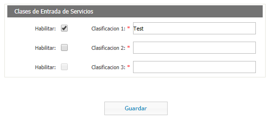
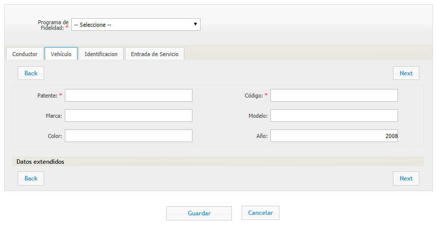
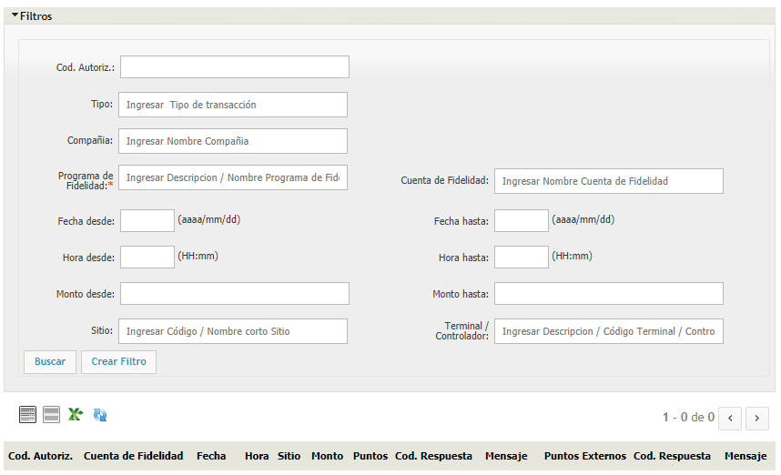
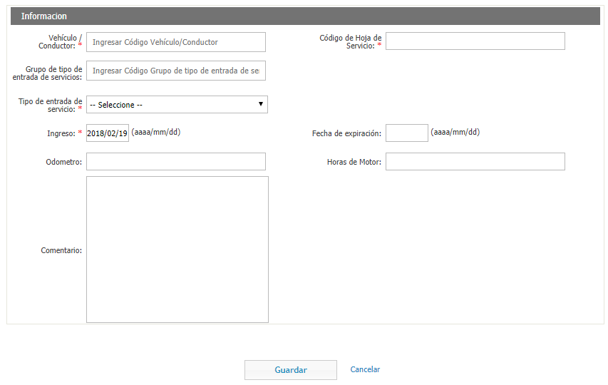
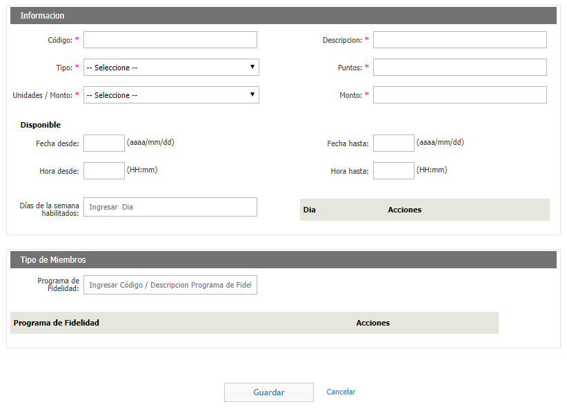
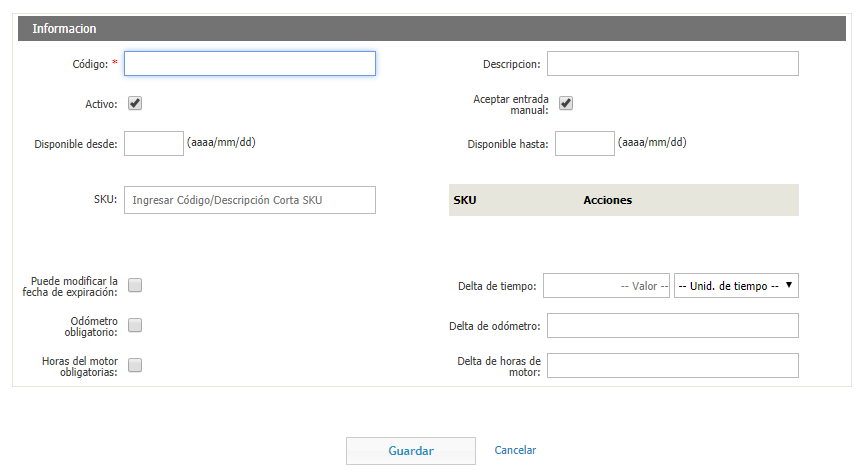

# ATIONet - Manual de Fidelidad

<table>
	<tr>
		<th colspan="2" align="left">Información documento</th>
	</tr>
	<tr>
		<td>Archivo:</td>
		<td>AN-Loyalty-UserManal-SP</td>
	</tr>
	<tr>
		<td>Version documento:</td>
		<td>1.0</td>
	</tr>
	<tr>
		<td>Fecha:</td>
		<td>15 Febrero 2018</td>
	</tr>
	<tr>
		<td>Autor:</td>
		<td>ATIO International LLC</td>
	</tr>
</table>

<table>
	<tr>
		<th colspan="3" align="left">Change Log</th>
	</tr>
	<tr>
		<td>Ver.</td>
		<td>Fecha</td>
		<td>Detalle cambio</td>
	</tr>
	<tr valign="top">
		<td>1.0</td>
		<td>15 Febrero 2018</td>
		<td>Version inicial.</td>
	</tr>
</table>

## Contents

<!-- MarkdownTOC depth=3 -->

- Visión general
- [Definiciones](#definiciones)
	- [Contrato](#contrato) 
	- [Sub cuenta](#sub-cuenta)
	- [Compañía](#compañía)
	- [Identificador](#identificador)
	- [Sitio](#sitio)
	- [Vehículo](#vehículo)
	- [Conductor](#conductor)
	- [Modulo offline](#modulo-offline)
	- [Terminal] (#terminal)
- [Fidelidad](#fidelidad)
	- [Ajustes](#ajustes)
	- [Clases de Entrada de Servicios](#clases-de-entrada-de-servicios)
	- [Cliente de Fidelidad](#cliente-de-fidelidad)
	- [Conciliaciones](#conciliaciones)
	- [Cuenta Corriente](#cuenta-corriente)
	- [Excepciones](#excepciones)
	- [Grupos de tipo de entrada de servicios](#grupos-de-tipo-de-entrada-de-servicios)
	- [Hojas de Servicio](#hojas-de-servicio)
	- [Programas](#programas)
	- [Redenciones](#redenciones)
	- [Reglas](#reglas)
	- [Test](#test)
	- [Tipos de Entrada de Servicio](#tipos-de-entrada-de-servicio)
	- [Transacciones](#transacciones)
	- [Transferencias](#transferencias)
	- [Unidades](#unidades)

<!-- /MarkdownTOC -->

## Visión General

ATIOnet se basa en la premisa de que las comunicaciones online entre sitios y el portal web son posibles, sin embargo, provee sólidos procedimientos de contingencia en el caso de que ocurra un error de comunicación.

La plataforma de ATIOnet es un servicio de administración de flotas con una innovadora y única oferta de mercado. Procesamiento en la nube, 100% web-based, acceso multi-usuario, disponibilidad y compartimiento de datos, actualizaciones instantáneas, seguridad, back-up automático y reducción de papeleo.

ATIOnet es un portal web para compañías de servicios de flotas que permite el procesamiento de transacciones desde cualquier aplicación de punto de venta mediante una interfaz simple y confiable. 

ATIOnet puede ser instalado en cualquier estación de servicio con uno o múltiples programas de servicios de flotas. El portal web le permite a los administradores de flotas acceso total a la información de sus vehículos.

ATIOnet hace posible que el administrador de flota opere, monitoree, cambie y edite la información de la flota en tiempo real.

## Definiciones

### Contrato 

El contrato es la relación que existe entre la network y el cliente, en el que se pauta, por ejemplo, si sera de importe o volumen, el precio al que se le va a vender el combustible, en que sitios puede cargar, entre otros.

### Sub Cuenta 

Cada vez que se asocia un identificador a un vehículo o un conductor se crea una sub cuenta. La sub cuenta es en definitiva quien va a tener una cuenta corriente, la sub cuenta va a poder recibir depósitos de dinero o producto. Las reglas también impactan a la sub cuenta.

Las sub cuentas dependen jerarquicamente del contrato.

### Compañía 

En ATIOnet, la compañía se refiere a la empresa dueña de la flota.

### Identificador 

El identificador es el medio físico que utiliza ATIONet para poder identificar un vehículo o un conductor. ATIONet soporte varios tipos de identificaciones, como ser tarjeta, tag (anillo), chip, tarjeta ATIONet, entrada manual, código de barras e iButton. Cuando se asocia un identificador a un Vehículo o Conductor se crea una sub cuenta.

### Sitio 

El Sitio representa a la estación de servicio. A un sitio se le asigna la terminal y también puede tener asociadas reglas de Ubicación.

### Vehículo 

Los vehículos pueden ser asociados o agrupados por una flota, pueden tener reglas asociadas y al momento de ser relacionados con un identificador se crea una sub cuenta. También pueden tener un conductor asociado.

### Conductor 

El Conductor es la persona que esta identificado en ATIONet como un conductor. Si a este conductor se le asigna un identificador, se crea una sub cuenta. Los conductores también pueden tener reglas asociadas.

### Modulo Offline 

El modulo offline de ATIONet se activa automáticamente cuando la estación de servicio se queda sin conexión a Internet y las autorizaciones no se pueden procesar online. En este momento entra en juego el modulo offline. Para el controlador Nano CPI es totalmente transparente. Cuando el modulo offline recupera la conectividad envía toda la información procesada localmente y también baja las novedades. Mientras haya conectividad el modulo offline esta continuamente bajando las novedades (saldos, identificadores, reglas, etc) de ATIONet.

### Terminal

La terminal (o controlador) es la representación del controlador de surtidores, que necesita parametrizarse de manera particular según el tipo de terminal. Las terminales que ATIONet maneja son ATIO-NanoCPI, ATIO-Standalone, ATIO-CG, VF-Standalone, VF-Sapphire, VF-Ruby, ControlGas y OPW-FSC3000. 

## Fidelidad

### Ajustes

Lorem ipsum dolor sit amet, consectetur adipiscing elit. Vivamus mollis quam ac ligula maximus, vitae dictum lorem consequat. Curabitur interdum pretium cursus. Vestibulum pharetra sodales enim, ut vestibulum dui semper quis. Aliquam convallis nulla eu neque vestibulum eleifend. Nam feugiat leo a bibendum rutrum. Duis quis augue et dui vulputate rhoncus. Sed vitae felis fringilla, lacinia est vel, imperdiet leo. Sed suscipit neque risus, eu pharetra dolor rhoncus ac.

### Clase de Entrada de Servicios

Lorem ipsum dolor sit amet, consectetur adipiscing elit. Vivamus mollis quam ac ligula maximus, vitae dictum lorem consequat. Curabitur interdum pretium cursus. Vestibulum pharetra sodales enim, ut vestibulum dui semper quis. Aliquam convallis nulla eu neque vestibulum eleifend. Nam feugiat leo a bibendum rutrum. Duis quis augue et dui vulputate rhoncus. Sed vitae felis fringilla, lacinia est vel, imperdiet leo. Sed suscipit neque risus, eu pharetra dolor rhoncus ac.

### Cliente de Fidelidad

Lorem ipsum dolor sit amet, consectetur adipiscing elit. Vivamus mollis quam ac ligula maximus, vitae dictum lorem consequat. Curabitur interdum pretium cursus. Vestibulum pharetra sodales enim, ut vestibulum dui semper quis. Aliquam convallis nulla eu neque vestibulum eleifend. Nam feugiat leo a bibendum rutrum. Duis quis augue et dui vulputate rhoncus. Sed vitae felis fringilla, lacinia est vel, imperdiet leo. Sed suscipit neque risus, eu pharetra dolor rhoncus ac.

### Conciliaciones

Lorem ipsum dolor sit amet, consectetur adipiscing elit. Vivamus mollis quam ac ligula maximus, vitae dictum lorem consequat. Curabitur interdum pretium cursus. Vestibulum pharetra sodales enim, ut vestibulum dui semper quis. Aliquam convallis nulla eu neque vestibulum eleifend. Nam feugiat leo a bibendum rutrum. Duis quis augue et dui vulputate rhoncus. Sed vitae felis fringilla, lacinia est vel, imperdiet leo. Sed suscipit neque risus, eu pharetra dolor rhoncus ac.

### Cuenta Corriente

Lorem ipsum dolor sit amet, consectetur adipiscing elit. Vivamus mollis quam ac ligula maximus, vitae dictum lorem consequat. Curabitur interdum pretium cursus. Vestibulum pharetra sodales enim, ut vestibulum dui semper quis. Aliquam convallis nulla eu neque vestibulum eleifend. Nam feugiat leo a bibendum rutrum. Duis quis augue et dui vulputate rhoncus. Sed vitae felis fringilla, lacinia est vel, imperdiet leo. Sed suscipit neque risus, eu pharetra dolor rhoncus ac.

### Excepciones

Lorem ipsum dolor sit amet, consectetur adipiscing elit. Vivamus mollis quam ac ligula maximus, vitae dictum lorem consequat. Curabitur interdum pretium cursus. Vestibulum pharetra sodales enim, ut vestibulum dui semper quis. Aliquam convallis nulla eu neque vestibulum eleifend. Nam feugiat leo a bibendum rutrum. Duis quis augue et dui vulputate rhoncus. Sed vitae felis fringilla, lacinia est vel, imperdiet leo. Sed suscipit neque risus, eu pharetra dolor rhoncus ac.

### Grupos de tipo de entrada de servicios

Lorem ipsum dolor sit amet, consectetur adipiscing elit. Vivamus mollis quam ac ligula maximus, vitae dictum lorem consequat. Curabitur interdum pretium cursus. Vestibulum pharetra sodales enim, ut vestibulum dui semper quis. Aliquam convallis nulla eu neque vestibulum eleifend. Nam feugiat leo a bibendum rutrum. Duis quis augue et dui vulputate rhoncus. Sed vitae felis fringilla, lacinia est vel, imperdiet leo. Sed suscipit neque risus, eu pharetra dolor rhoncus ac.

### Hojas de Servicio

Lorem ipsum dolor sit amet, consectetur adipiscing elit. Vivamus mollis quam ac ligula maximus, vitae dictum lorem consequat. Curabitur interdum pretium cursus. Vestibulum pharetra sodales enim, ut vestibulum dui semper quis. Aliquam convallis nulla eu neque vestibulum eleifend. Nam feugiat leo a bibendum rutrum. Duis quis augue et dui vulputate rhoncus. Sed vitae felis fringilla, lacinia est vel, imperdiet leo. Sed suscipit neque risus, eu pharetra dolor rhoncus ac.

### Programas

Lorem ipsum dolor sit amet, consectetur adipiscing elit. Vivamus mollis quam ac ligula maximus, vitae dictum lorem consequat. Curabitur interdum pretium cursus. Vestibulum pharetra sodales enim, ut vestibulum dui semper quis. Aliquam convallis nulla eu neque vestibulum eleifend. Nam feugiat leo a bibendum rutrum. Duis quis augue et dui vulputate rhoncus. Sed vitae felis fringilla, lacinia est vel, imperdiet leo. Sed suscipit neque risus, eu pharetra dolor rhoncus ac.

### Redenciones

Lorem ipsum dolor sit amet, consectetur adipiscing elit. Vivamus mollis quam ac ligula maximus, vitae dictum lorem consequat. Curabitur interdum pretium cursus. Vestibulum pharetra sodales enim, ut vestibulum dui semper quis. Aliquam convallis nulla eu neque vestibulum eleifend. Nam feugiat leo a bibendum rutrum. Duis quis augue et dui vulputate rhoncus. Sed vitae felis fringilla, lacinia est vel, imperdiet leo. Sed suscipit neque risus, eu pharetra dolor rhoncus ac.

### Reglas

En ATIONet las reglas son ?

#### Crear una nueva regla

Para crear una nueva regla, haga click en el boton "Nuevo" que se encuentra en el extremo superior izquierdo de la vista.

Los campos a completar son los siguientes:

* ***Codigo***: El codigo que le quiere asignar a la nueva regla.
* ***Descripcion***: La descripcion de la nueva regla.
* ***Tipo***: Seleccione el tipo de regla que puede ser de Monto de Transaccion, SKU, Categoria de SKU, Metodo de Pago, Monto de Transaccion y Metodo de Pago, SKU y Metodo de Pago o Categoria de SKU y Metodo de Pago.
* ***Puntos***: La cantidad de puntos que entrega la regla.
* ***Unidades/Monto***: ?
* ***Monto***: ?
* ***Fecha Desde/Hasta***: Ingrese el rango de fechas en el cual estara activa la regla.
* ***Hora Desde/Hasta***: Ingrese el rango horario en el cual estara activa la regla.
* ***Dias de la semana habilitados***: Ingrese los dias de la semana en los cuales estara activa la regla.
* ***Programa de Fidelidad***: Ingrese el programa de fidelidad al cual le quiere asignar esta regla.

Cuando termine de llenar los campos cliquee el boton "Guardar".

### Tipos de Entrada de Servicio

Lorem ipsum dolor sit amet, consectetur adipiscing elit. Vivamus mollis quam ac ligula maximus, vitae dictum lorem consequat. Curabitur interdum pretium cursus. Vestibulum pharetra sodales enim, ut vestibulum dui semper quis. Aliquam convallis nulla eu neque vestibulum eleifend. Nam feugiat leo a bibendum rutrum. Duis quis augue et dui vulputate rhoncus. Sed vitae felis fringilla, lacinia est vel, imperdiet leo. Sed suscipit neque risus, eu pharetra dolor rhoncus ac.

### Transacciones

En esta vista usted puede consultar las transacciones realizadas, listadas por Codigo de Autorizacion, la Cuenta de Fidelidad a la que esta asociada la transaccion; La fecha, la hora y el sitio donde ocurrio la transaccion, la cantidad de puntos que fueron otorgados por esa transaccion, y el monto de la transaccion. Tambien cuenta con un boton para descargar una plantilla con los datos de las transacciones.

Esta vista cuenta con un panel de filtros para hacer mas faciles las consultas. Los campos que tiene disponibles para filtrar son los siguientes:

* ***Cod. Autorizacion***: El codigo de autorizacion de la transaccion.
* ***Tipo***: El tipo de transaccion (Puede ser de Acumulacion, Redencion, Transferencia, Ajuste o Devolucion).
* ***Compania***: Ingrese el nombre de la compania el cual quiere buscar transacciones relacionadas a ella.
* ***Programa de Fidelidad***: Ingrese el nombre del programa de fidelidad el cual quiere buscar transacciones relacionadas a ella.
* ***Cuenta de Fidelidad***: Ingrese el nombre de la cuenta de fidelidad el cual quiere buscar transacciones relacionadas a ella.
* ***Fecha Desde/Fecha Hasta***: Ingrese el rango de fechas por el cual quiere filtrar transacciones.
* ***Hora Desde/Hora Hasta***: Ingrese el rango horario por el cual quiere filtrar transacciones.
* ***Monto Desde/Monto Hasta***: Ingrese el rango de montos por el cual quiere filtrar transacciones.
* ***Sitio***: Ingrese el sitio por el cual quiere filtrar transacciones.
* ***Terminal/Controlador***: Ingrese la terminal/controlador por el cual quiere filtrar transacciones.

Cuando termine de llenar los campos que quiera, puede cliquear en "Crear Filtro" para guardarlo para futuras ocasiones, o simplemente en "Buscar" para filtrar los resultados.

### Transferencias

En esta vista usted puede consultar las transacciones realizadas, listadas por Sitio, Fecha y Hora; la cuenta de Fidelidad de donde fueron transferidos los puntos y la cuenta de Fidelidad a la que fueron transferidos los puntos, la cantidad de puntos, el codigo de respuesta de la transferencia y el mensaje respuesta que arrojo la transferencia.

Esta vista cuenta con un panel de filtros para hacer mas faciles las consultas. Los campos que tiene disponibles para filtrar son los siguientes:

* ***Vehiculo***: ?
* ***Conductor***: ?
* ***Sitio***:
* ***Terminal/Controlador***:
* ***Fecha Desde/Fecha Hasta***: Ingrese el rango de fechas por el cual quiere filtrar transferencias.
* ***Hora Desde/Hora Hasta***: Ingrese el rango horario por el cual quiere filtrar transacciones.

Cuando termine de llenar los campos que quiera, puede cliquear en "Crear Filtro" para guardarlo para futuras ocasiones, o simplemente en "Buscar" para filtrar los resultados.

### Unidades

Lorem ipsum dolor sit amet, consectetur adipiscing elit. Vivamus mollis quam ac ligula maximus, vitae dictum lorem consequat. Curabitur interdum pretium cursus. Vestibulum pharetra sodales enim, ut vestibulum dui semper quis. Aliquam convallis nulla eu neque vestibulum eleifend. Nam feugiat leo a bibendum rutrum. Duis quis augue et dui vulputate rhoncus. Sed vitae felis fringilla, lacinia est vel, imperdiet leo. Sed suscipit neque risus, eu pharetra dolor rhoncus ac.

#### Crear una nueva unidad

Para crear una nueva unidad haga click en el boton "Nuevo" que se encuentra en el extremo superior izquierdo de la pantalla".

Los campos  completar son los siguientes:

* ***Codigo***: El codigo que le quiere asignar a la nueva unidad.
* ***Nombre***: El nombre que le quiere asignar a la nueva unidad.
* ***Codigo de Moneda***: ?