# ATIONet - Network User Manual (Network Type Subscription)

<table>
	<tr>
		<th colspan="2" align="left">Document information</th>
	</tr>
	<tr>
		<td>Archive:</td>
		<td>AN-Network-UserManal-SP</td>
	</tr>
	<tr>
		<td>Document version:</td>
		<td>1.0</td>
	</tr>
	<tr>
		<td>Date:</td>
		<td>2 August 2017</td>
	</tr>
	<tr>
		<td>Author:</td>
		<td>ATIO International LLC</td>
	</tr>
</table>

<table>
	<tr>
		<th colspan="3" align="left">Change Log</th>
	</tr>
	<tr>
		<td>Ver.</td>
		<td>Date</td>
		<td>Detail of change</td>
	</tr>
	<tr valign="top">
		<td>1.0</td>
		<td>2 August 2017</td>
		<td>Initial version.</td>
	</tr>
</table>

## Contents

<!-- MarkdownTOC depth=3 -->

- Overview
- [Definitions](#definitions)
	- [Contract](#contract) 
	- [Sub account](#sub-account)
	- [Company](#company)
	- [Identifiers](#identifiers)
	- [Site](#site)
	- [Vehicle](#vehicle)
	- [Driver](#driver)
	- [Offline module](#offline-module)
- [Navigation Menu](#navigation-menu)
	- [Board](#board)
		- [General Status](#general-status)
		- [Liters-Months](#liters-months)
		- [Daily Transactions](#daily-transactions)
		- [List of Pending Pre-Authorizations](#list-of-pending-pre-authorizations)
		- [Transactions marked last month](#transactions-marked-last-month)
		- [Installations](#installations)
		- [Sub-cuentas con excepciones](#sub-cuentas-con-excepciones)
		- [Actualizaciones de Identificador en ultimo mes](#actualizaciones-de-identificador-en-ultimo-mes)
		- [Transacciones recientes](#transacciones-recientes)
		- [Listado de Sub-cuentas con bajo saldo](#listado-de-sub-cuentas-con-bajo-saldo)
		- [Estado de Terminales](#estado-de-terminales)
		- [Contratos sin actividad](#contratos-sin-actividad)
		- [Listado de contratos con bajo saldo](#listado-de-contratos-con-bajo-saldo)
	- [Favoritos](#favoritos)	
	- [Vistas](#vistas)
		- [Autorizaciones Pendientes](#autorizaciones-pendientes)
		- [Conductores](#conductores)
		- [Cuentas corrientes de Comercio](#cuentas-corrientes-de-comercio)
		- [Cuentas corrientes de Compañia](#cuentas-corrientes-de-compañía)
		- [Transacciones](#transacciones)
		- Transacciones por Conductor
		- Transacciones por Flota
		- Transacciones por Sitio
		- Transacciones por Vehículo
		- [Transacciones Rechazadas](#transacciones-rechazadas)
		- [Transacciones sin Control](#transacciones-sin-control)
		- [Vehiculos](#vehiculos)
	- [Reportes](#reportes)
		- [Conductor](#conductor)
		- [Transacciones](#transacciones)
		- [Vehiculo](#vehiculos)
	- [Inventario](#inventario)
		- Grafico de Inventarios
		- Inventario
		- Recepciones
		- Reconciliación Inventario 
	- [Administración](#administración)
		- [Categorías de SKUs](#categorías-de-skus)
		- [Comercios](#comercios)
		- [Compañias](#compañias)
		- [Conceptos](#conceptos)
		- [Configuración de Fast Track](#configuración-de-fast-track)
		- [Contingencia](#contingencia)
		- [Contratos de Comercios](#contratos-de-comercios)
		- [Contratos de Compañias](#contratos-de-compañias)
		- [Cuentas corrientes de Comercio](#cuentas-corrientes-de-comercio)
		- [Cuentas corrientes de Compañia](#cuentas-corrientes-de-compañia)
		- [Depositos](#depositos)
		- [Familias de Conceptos](#familias-de-conceptos)
		- [Identificaciones Solicitadas](#identificaciones-solicitadas)
		- [Identificadores](#identificadores)
		- [Impuestos](#impuestos)
		- [Installations](#installations)
		- [Métodos de Pago](#metodos-de-pago)
		- [Modelos de Identificador](#modelos-de-identificador)
		- [Programas](#programas)
		- [Sitios](#sitios)
		- [SKUs](#skus)
		- [Tarjeta de Regalo](#tarjeta-de-regalo)
		- [Tarjetas de Regalo Solicitadas](#tarjetas-de-regalo-solicitadas)
		- [Transacciones Desconocidas](#transacciones-desconocidas)
		- [Usuarios](#usuarios)
- [Mis Filtros](#mis-filtros)
- [Solución de Problemas](#solucion-de-problemas)
- [Mis Preferencias](#mis-preferencias)
- [Configuración Nano CPI para ATIONet](#configuración-nano-cpi-para-ationet)

<!-- /MarkdownTOC -->

## Overview

ATIOnet is based on the premise that online communications between sites and the web portal are possible, however, it provides solid contingency procedures in the event of a communication error.

The ATIOnet platform is a fleet management service with an innovative and unique market offer. Cloud processing, 100% web-based, multi-user access, data availability and sharing, instant updates, security, automatic back-up and paperwork reduction.

ATIOnet is a web portal for fleet service companies that allows the processing of transactions from any point of sale application through a simple and reliable interface. 

ATIOnet can be installed at any service station with one or multiple fleet service programs. The web portal allows fleet managers full access to their vehicle information.

ATIOnet makes it possible for the fleet manager to operate, monitor, change and edit fleet information in real time.

## Definitions

### Contract 

The contract is the relationship that exists between the network and the client, in which it is guided, for example, if it will be of amount or volume, the price at which the fuel is going to be sold, in which sites it can load, among others.

### Sub account 

Each time an identifier is associated with a vehicle or driver, a sub-account is created. The sub account is definitely who is going to have a current account, the sub account is going to be able to receive deposits of money or product. The rules also impact the sub account.

The sub-accounts are hierarchically dependent on the contract.

### Company

In ATIOnet, the company refers to the company that owns the fleet.

### Identifiers 

The identifier is the physical means used by ATIONet to identify a vehicle or driver. ATIONet supports various types of identification, such as card, tag (ring), chip, ATIONet card, manual entry, barcode and iButton. When an identifier is associated to a Vehicle or Driver, a sub account is created.

### Site 

The Site represents the service station. A site is assigned the terminal and may also have associated Location rules.

### Vehicle 

The vehicles can be associated or grouped by a fleet, they can have associated rules and at the moment of being related with an identifier a sub account is created. They may also have an associated driver.

### Driver 

The Driver is the person who is identified in ATIONet as a driver. If this driver is assigned an identifier, a sub account is created. Drivers may also have associated rules.

### Offline module 

ATIONet's offline module is automatically activated when the service station has no Internet connection and the authorisations cannot be processed online. At this point the offline module comes into play. For the Nano CPI controller it is completely transparent. When the offline module recovers the connectivity it sends all the information processed locally and also lowers the news. As long as there is connectivity, the offline module is continuously downloading ATIONet news (balances, identifiers, rules, etc).

### Terminal

The terminal (or controller) is the representation of the dispenser controller, which needs to be parameterized in a particular way according to the type of terminal. The terminals handled by ATIONet are ATIO-NanoCPI, ATIO-Standalone, ATIO-CG, VF-Standalone, VF-Sapphire, VF-Ruby, ControlGas and OPW-FSC3000. 

### Navigation Menu

ATIOnet has a quick access menu located on the left side of the page. From this menu you can access the different options. The menu is divided into 7 sections. (Dashboard, Favorites, Views, Reports, Inventory, Administration and Logbook)

### Board

The Board is a page where you will have a global vision of the operation of your network. The dashboard has specific widgets that will help you make preventive or corrective decisions according to the information and data they show. The data shown in the Dashboard is real time data. Some of the widgets are automatically refreshed.
These can be removed or added according to the user's needs in the My Preferences window. They can also be placed on the board according to the level of visibility you want to give each one.
The complete list of widgets available for Network subscriptions is as follows:

#### General Status

This widget is very important when starting up the network. This widget gives us information of which parameters we need to configure to be operative. It warns us when, for example, we don't have vehicles or identifications created among other parameters.
This widget can show "Warnings" (yellow icon) when the operation of the network is not in play, but if it shows a red cross indicates that the network is not operational.

#### Liters-Months

The "Liters/Month" indicates the amount of each fuel dispensed in the last month. The last month is the last 30 days from the day of the date. This widget has the ability to filter by Site, City and Fleet. You must select the filter and then enter the value by which it should be filtered. This last field is of the "auto complete" type.

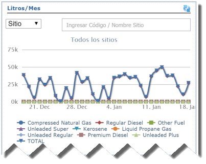

#### Daily Transactions

This widget contains a pie chart that shows very quickly how many transactions were approved and how many were rejected during the day.

#### List of Pending Pre-Authorizations

This list widget displays all preauthorizations that have not yet received the completion transaction. (For more details on the transaction flow refer to this one [document](AN-Transaction_Flows-TechGuide.md).

This shows 7 columns:

1. ***Authorization Code:*** The authorization code assigned to the transaction.
2. ***Company:*** The company to which the vehicle in question belongs.
3. ***Patent:*** The patent of the vehicle.
4. ***Site:*** The site where the transaction took place.
5. ***Authorized:*** The amount that was authorized in the pre-authorization.
6. ***Pos:*** Position or pump informed by the point of sale or controller.
7. ***Age:*** The time in minutes that this pre-authorization has been in effect.

The pending pre authorizations should be dispatches in progress, if there are records in this widget with a high Age, means that the point of sale or controller did not send the completion transaction or the cancellation transaction in the case that fuel has not been dispatched.

#### Transactions marked last month

The following shows all transactions that were rejected by any of the validations made by ATIONet in the authorization process. Either due to lack of balance or rules among other validations. For more details on "Rejected Transactions" refer to this document: [TODO](#todo)

#### Contratos sin actividad

Displays the list of contracts that were never active.

#### Sub-cuentas con excepciones

This shows all sub-accounts that have something to pay attention to, such as:

1. ***Without Identifiers:*** These are vehicles or drivers that do not have an associated identifier.
2. ***With inactive identifiers:*** Are subaccounts that have an associated identifier that has been deactivated from the portal.
3. ***With Suspended Identifiers:*** Sub-accounts that have an identifier that has been suspended. ***Only ATIONet can suspend an identifier***.
4. ***With inactive drivers or vehicles:*** These are sub-accounts that have a vehicle or driver that has not been deactivated from the portal.

For more details about sub-accounts please consult:[Esta sección](#sub-cuenta)

#### Transacciones recientes

The following shows the last 20 completed transactions. It shows the most relevant data to be able to identify it, in case you need more information about the transaction you can click on the authorization code, that will take you to the view of details of the transaction.

#### Listado de contratos con bajo saldo

Shows the list of contracts with low balance to trade 4 more days. This calculation is based on usage. The "Days Available" column shows the number of days remaining in the contract based on usage analysis. This number is not exact and may vary if the usage pattern changes.

#### Listado de Sub-cuentas con bajo saldo

Shows the list of sub accounts containing low balance to trade 4 more days. This calculation is made based on the use of each sub account. The "Available Days" column shows the number of days left in the sub account based on the usage analysis. This number is not exact and may vary if the usage pattern changes.

#### Actualizaciones de Identificador en ultimo mes

This widget shows the activity of the administration of identifiers, shows the number of identifiers that were modified grouped by state.

1. ***Assigned:*** The number of identifiers that changed to the "Assigned" state.
2. ***Available:*** The number of identifiers that changed to the "Available" state.
3. ***Cancelled:*** The number of identifiers that changed to "Cancelled" status.
4. ***Reported:*** The number of identifiers that changed to "Reported" status.
5. ***Suspended:*** The number of identifiers that changed to "Suspended" status.

#### Estado de Terminales

All terminals that are natively connected to ATIONet send a regular message indicating that they are active. If the terminal reported the status in the last 5 hours, the terminal will be shown with the green icon, if not reported in the last 5 hours the icon will be red.
The column ***"Age "*** shows the number of minutes since the last time the terminal was reported. 

### Favoritos

Vehicles, Drivers, Sites and Fleets are entities that may require daily monitoring by certain users. To facilitate this task you can add some of these entities to the list of Favorites. Once entered an entity to this list the access is faster and direct, without the need to enter filters each time you want to search. 

Once inside the Favorites page, by clicking on the link in the "Type" column, you will be redirected to the detailed view of that entity. 

If you want to remove an entity from the list of Favorites, click on the icon on the right with the shape of a cross.

### Vistas

ATIONet has a series of views where you can view information on the operation of the network. ATIONet considers a view to all those screens that besides being able to visualize information, it is also exportable for a post processing. Unlike the [***Reportes***](#reportes) which are screens that display information in a format designed to be printed and saved.
All the views in ATIONet respect a consistency in aesthetics and functionality. All the views have a toolbar with all these functions (or at least some of them).

 

1. ***Condensed view:*** This option is active by default when the view is opened, this option shows in the grid the minimum data in a single line.
2. ***Detailed view:*** This option activates a second row in each record within the grid and shows more information from each of the records.
3. ***Print:*** When you click on this option, a new window opens with the data shown in the grid but with a format oriented to be printed, a header is included with the logo that the subscriber configured.
4. ***Export:*** By clicking on this option the information currently displayed in the grid is exported to Excel. An automatic download will start in your browser.
5. ***Update:*** Some views where the frequency of change of information is high, it might be useful to want to refresh the grid. This option refreshes the data immediately.  

Some views also have a filter panel. By default this panel appears collapsed, to display it click on the bar that says "Filters". Each view has specific fields by which you can filter. Once you have entered the desired values press the "Search" button.

The views also have pagination and the user will be able to define how many records per page are shown. This configuration is done from [***Mis Preferencias***](#mis-preferencias)
The following is the view of ATIONet Vehicles:

#### Autorizaciones Pendientes

Pending authorizations are those transactions that have not yet received the completion transaction. The records seen in this view are shipments that are currently underway. If for some reason there are old pre-authorizations, it is likely that the POS did not send the completion transaction or the cancellation transaction if the shipment was not completed.

Please note that at the time of preauthorization, ATIONet froze the amount of the authorization of the current account of the sub account.
This view presents all the fields necessary to identify the transaction and the vehicle. If you need to see more details, clicking on the authorization code will take you to the transaction details view.

If old pending transactions appear and you are sure it is not an ongoing shipment, you may cancel them and return the balance to the checking account.
To do this you have 2 ways, individually, by clicking on the "X" icon to the right of the grid or massively by selecting the transactions, displaying the "Batch Actions" menu and selecting "Cancel". This will cancel the transactions and return the balance to each of the current accounts.

(for more details on the transaction flow refer to this [documento](AN-Transaction_Flows-TechGuide.md))

#### Conductores

This view lists drivers who have been discharged. You can filter them by name, ID, company, alert rule or status. Also, in the options column to the right, you can choose to assign an ID, edit it, or mark the driver as a favorite.

#### Cuentas corrientes de Comercio

The trade current accounts view is the view where the balances and movements of the trades are consulted.
In ATIONet the term trade refers to the company that owns the sites.

This view has, like the rest of the views, a panel of filters.
The first option in the panel is the type of report we want to see.

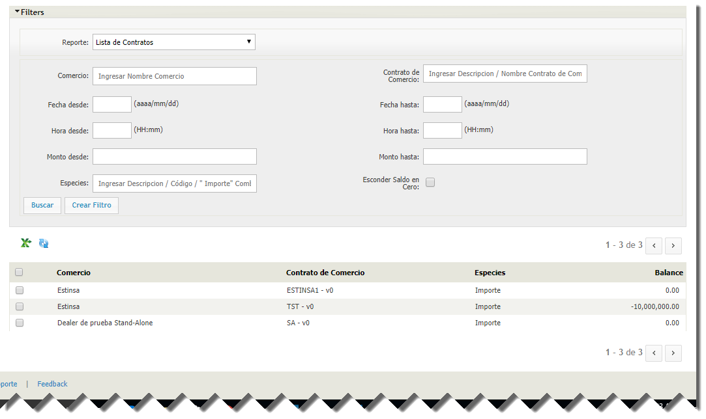

#### Cuentas corrientes de Compañía

The Company Checking Accounts view is the view where the available sub account balances are consulted (Remember that the sub account is the union between a vehicle/driver and an identifier. For more details on sub-accounts consult: [Esta sección](#sub-cuenta)).

In ATIONet the term company refers to the company that owns the fleet. For more details about companies consult: [Esta sección](#compañía)

This view has, like the rest of the views, a panel of filters.
The first option in the filter panel is the type of report we want to see:

1. ***List of Contracts:*** This option lists the contracts with their respective balance, but does not give details of the movements, it is a view that summarizes the data of each of the sub-accounts.

	

2. ***Contract Movements:*** This option lists the sub-accounts with their respective balance, but does not give details of the movements, it is a view that summarizes the data of each of the sub-accounts.

	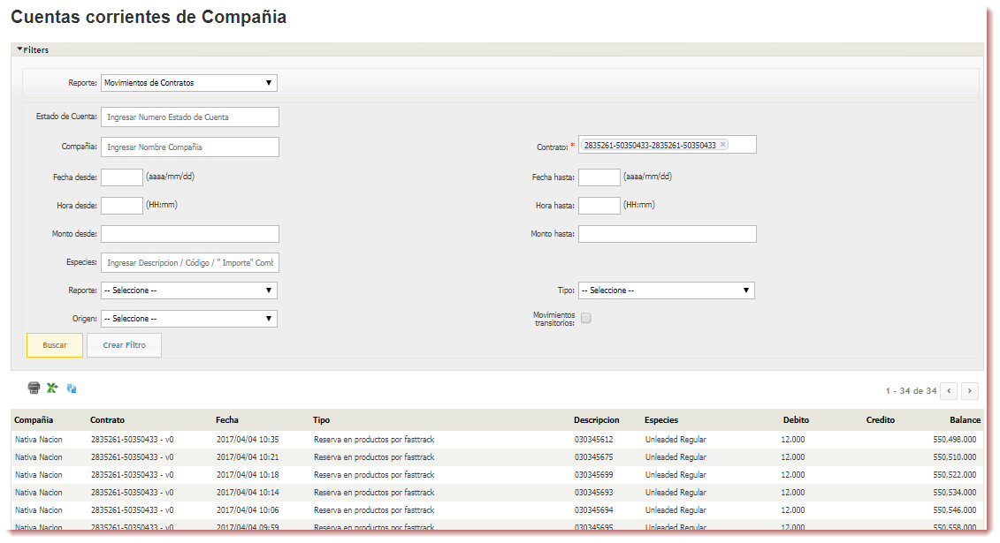

3. ***List of Sub-accounts:*** This option lists the sub-accounts with their respective balance, but does not give details of the movements, it is a view that summarizes the data of each of the sub-accounts.

	

4. ***Sub-accounts Movements:*** This view option shows in detail each of the movements of the sub-account, both credits and debits.   

	

Selecting this second option enables several more filters:

* ***Account Statement:*** Account Statement Number.
* If you enter one or more sub-account names, only the movements of those sub-accounts will be listed. Note that this field is "autocomplete", will be completed as you type, if you press the space bar will show all subaccounts.
* ***Date From / Date To:*** Entering these values will filter the movements between the two dates.
* ***Time From / Time To:*** Entering these values will filter the movements between the two hours.
* ***Amount From / Amount To:*** Entering these values will filter the movements whose amount is between both values.
* ***Species:*** You can filter by species (Product).
* ***Debit / Credit:*** You can select which type of movements you want to see, whether debit or credit.
* ***Type:*** What type of movement generated the movement in the current account
***Origin:***Origin of the movement, whether it is the ATIONet console, a mobile application or a call to the API from a third party application.
* ***Transient Movements:*** Checking this option will show the internal movements generated by ATIONet. For example, each time a balance is frozen after a pre-authorization and a termination transaction is received, ATIONet returns the frozen balance and subsequently debits the final amount reported. The return of the frozen balance is considered a transitory movement and is not shown if this option is not selected.

#### Excepciones

ATIONet separates unauthorized transactions into 2 sections, Exceptions and [Transacciones Rechazadas](#transacciones-rechazadas).
Exceptions are those transactions that did not pass the hard validations of the system or those that are detected as possible frauds.

In the Exceptions view we can filter by Exception type first. The types of Exceptions available are as follows:

This view also has the filter panel mentioned above. It is worth highlighting the ***"Offline Transactions "*** filter, by checking this option, it will also show those transactions that were marked as Exceptions in the Offline module. 
(for more details about the Offline module see this [sección](#modulo-offline))

Once you have selected the filters, press ***"Search "***" and all transactions marked as Exceptions will appear in the list.

Some transactions remain in "Review" status in some situations, such as when more than authorized is sent (due to a controller or POS error). In these cases it is necessary to approve or reject the transaction using one of the two icons to the right of each record.

#### Transacciones

The transaction view is one of the most important in ATIONet. In this view you can see the transactions that were made and approved.

The Filter panel has all these possibilities:

* ***Authorization Code:*** Authorization Code delivered by ATIONet.
* ***Vehicle:*** Vehicle or Vehicles (autocomplete field and multiple selection, pressing the space bar will list the first 20 vehicles).
* ***Fleet:***The name of the fleet. (autocomplete and multiple selection field)
* ***Site:*** The name of the site. (autocomplete and multiple selection field)
* ***Date From / Date To:*** Range of dates.
* ***Time From / Time To:*** Range of hours.
* ***Period Performance:*** ?
* ***Offline Transactions:*** Checking this option will also list the approved transactions in Offline mode. (for more details on the Offline module please see this [sección](#modulo-offline))
* ***Shift:*** The turn in which the transaction occurred. (as long as the terminal or POS informs you)
* ***Driver:***The name of the driver. (autocomplete and multiple selection field).
* ***Terminal / Controller:*** Name of the terminal that recorded the transaction. (Autocomplete and multiple selection field).
* ***Fuel:*** The product involved in the transaction. (autocomplete and multiple selection field)
* ***Show Complete Transactions at Zero:*** Checking this option will also show transactions that have been sent with amount or volume at 0.
* ***Product Transactions:*** Checking this option will also show transactions that contain dry products.

Once you have selected the desired filter, press ***"Search "*** and it will list the transactions that comply with the filter.

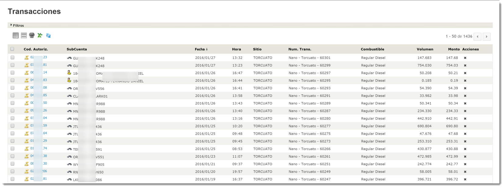

The grid shows the main data of the transaction, in the actions column you can ignore a transaction and enter the process of ignorance. (for more details on the ignorance of transactions see this [sección](#transacciones-desconocidas)).

If you want to see the transaction detail, click on the Authorization Code, this will take you to a detail view of the transaction.

 

#### Transacciones por Conductor

In this view you can see the transactions, grouped by the driver who made them. The buttons at the top left are for printing the table or creating an Excel file from the table, respectively.

The filter panel has the following possibilities:

* ***Group by:***Site, Fleet, Program, Vehicle ID and/or Date.
* ***Driver:***Filter by driver who dispatched.
* ***Fleet:*** Filter by fleet to which the vehicle that made the dispatch belongs.
* ***Vehicle ID:***Filter by the ID of the vehicle that made the dispatch.
* ***Site:***Filter by the place where the dispatch took place.
* ***Terminal/Controller:*** Filter by terminal/controller that dispatched.
* ***Fuel:***Filter by the fuel that was dispatched.
* ***Date from/Date to:*** Range of dates to filter.
* ***Time from/to:*** Range of hours to filter.

When you have finished filling out the form, click "Search" to apply the filter, or "Create filter" to save the filter done.

#### Transacciones por Flota

In this view you can see the transactions that were made, grouped by fleet. The buttons at the top left are for printing the table or creating an Excel file from the table, respectively.

The filter panel has the following possibilities:

* ***Group by:***Site, Vehicle, Driver ID and/or Date.
* ***Fleet:*** Filter by fleet to which the vehicle that made the dispatch belongs.
* ***Vehicle:*** Filter by the vehicle that made the dispatch.
* ***Driver:***Filter by the ID of the driver who made the dispatch.
* ***Site:*** Filter by the place where the dispatch took place.
* ***Fuel:***Filter by the fuel that was dispatched.
* ***Terminal/Controller:*** Filter by terminal/controller that dispatched.
* ***Date from/Date to:*** Range of dates to filter.
* ***Time from/time to:*** Range of hours to filter.

When you finish filling the form, click "Search" to apply the filter, or "Create filter" to save the filter done.

#### Transacciones por Sitio

In this view you can see the transactions that took place, grouped by the place where they took place. The buttons at the top left are for printing the table or creating an Excel file from the table, respectively.

The filter panel has the following possibilities:

* ***Group by:***Fuel, Fleet, Program, Shift and/or Date.
* ***Site:***Filter by the place where the dispatch took place.
* ***Fuel:***Filter by the fuel that was dispatched.
* ***Fleet:*** Filter by fleet to which the vehicle that made the dispatch belongs.
* ***Terminal/Controller:*** Filter by terminal/controller that dispatched.
* ***Date from/Date to:*** Range of dates to filter.
* ***Time from/to:*** Range of hours to filter.

When you finish filling the form, click "Search" to apply the filter, or "Create filter" to save the filter done.

#### Transacciones por Vehículo

In this view you can see the transactions, grouped by the vehicle that made them. The buttons at the top left are for printing the table or creating an Excel file from the table, respectively.

The filter panel has the following possibilities:

* ***Group by:***Site, Fleet, Program, Driver ID and/or Date.
* ***Vehicle:*** Filter by vehicle that made the dispatch.
* ***Fleet:*** Filter by fleet to which the vehicle that made the dispatch belongs.
* ***Driver:***Filter by the ID of the driver who made the dispatch.
* ***Site:*** Filter by the place where the dispatch took place.
* ***Terminal/Controller:*** Filter by terminal/controller that dispatched.
* ***Fuel:***Filter by the fuel that was dispatched.
* ***Date from/Date to:*** Range of dates to filter.
* ***Time from/to:*** Range of hours to filter.

When you have finished filling out the form, click "Search" to apply the filter, or "Create filter" to save the filter done.

#### Transacciones Rechazadas

ATIONet separates unauthorized transactions into 2 sections, [Excepciones](#excepciones)and Rejected Transactions.
Rejected Transactions are those transactions that managed to pass ATIONet's hard validations but were rejected by other validations such as an unsatisfied rule or balance validation.

In the Rejected Transactions view we can filter by the type of rejection first. The types of rejections available are as follows:

This view also has the filter panel mentioned above. It is worth highlighting the ***"Offline Transactions "*** filter, by checking this option, it will also show those transactions that were marked as rejected in the Offline module. 
(for more details about the Offline module see this [sección](#modulo-offline))

Once you select the filters, press ***"Search "*** and all transactions marked as rejected will be listed.

It should be clarified that there is a possibility that a transaction may be rejected but that the fuel has been delivered. This occurs when the rejection occurs in the termination transaction.
Some of the most common reasons for this situation are the following:

* The pre authorization is expired (more than 3hs between the date of creation of the pre authorization and the date of creation of the termination. This is not related to the time it may take for the termination to arrive in offline mode).
* There is no existing pre-authorization for that transaction.
* The pre-authorization was cancelled manually.
* The termination transaction contains invalid information (errors in the terminal or controller).
* The termination transaction was executed with errors on the host.
* The termination transaction contains different information than the pre-authorization information, such as for example.
* The termination transaction reports more volume or amount than was authorized. In this case the authorization can be approved.

#### Transacciones sin Control

Uncontrolled transactions are those transactions that are generated because the controller detects a difference in gauges and sends a transaction for the difference. These transactions do not contain data about the identifier since they were generated automatically and were not initiated with the presentation of an identifier. As they do not have an identifier assigned, they are not impacted in any current account nor do they count for the calculation of rules.
This view also filters panel to make more specific searches.

#### Vehicles

This view lists the vehicles that have been discharged. Remember that it is not mandatory to load vehicles in order to operate, it is only necessary if you decide to associate the identifiers to vehicles.

This view has the panel of filters to be able to specify more the search. It is necessary to emphasize the filter "Without Identification", selecting this option, will be shown only those vehicles that have not been assigned to an identifier. 

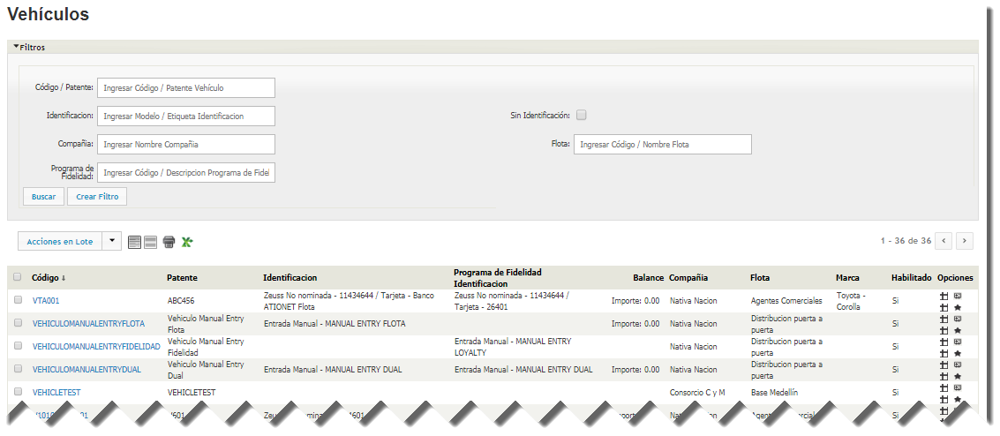

To see more details of the vehicle, click on the code:

### Reports

In ATIONet the reports are considered those lists of information that if or if they are going to be printed and filed in physical format. When they are printed, ATIONet adds a header with the logo of the subscription automatically.

#### Driver

The Driver report can be filtered by driver name/code or by identification.
Once the filter is selected press the ***Print*** button, this will display a popup with the selected information.
The information is displayed in a print-ready format, including the subscription logo and the date and time of report generation.

This popup has a print button that when pressed opens the default print window of the Internet browser.

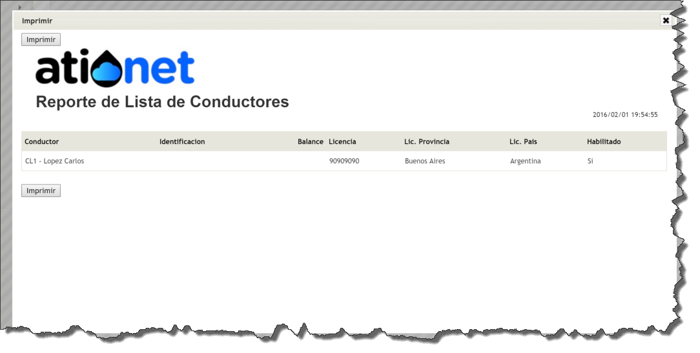

#### Transactions

This report shows the list of transactions made, sorted by date. This report has several filters to adjust the search. The first field of the filter panel indicates why the field will sort the list, the field selected in this list will be shown in the first column.

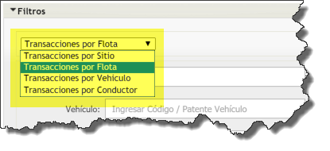

Once the filter is selected press the ***Print*** button, this will display a popup with the selected information.
The information is displayed in a print-ready format, including the subscription logo and the date and time of report generation.

This popup has a print button that when pressed opens the default print window of the Internet browser.

#### Vehicle

This report shows the list of vehicles. This report has several filters to adjust the search. The first field of the filter panel indicates why the field will sort the list, the field selected in this list will be shown in the first column.

Once the filter is selected press the ***Print*** button, this will display a popup with the selected information.
The information is displayed in a print-ready format, including the subscription logo and the date and time the report was generated.

This popup has a print button that when pressed opens the default print window of the Internet browser.

### Inventory

#### Inventory Chart

#### Inventarios

#### Recepciones

#### Reconciliación Inventario

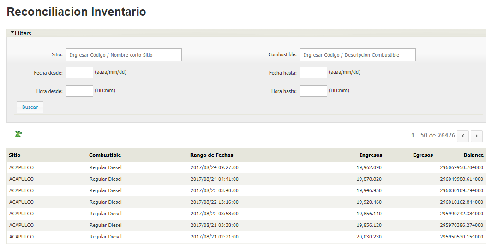

### Administration
 
#### SKU Categories

In this section you can consult the categories of SKUs (Stock Keeping Units) already created and, if you want, edit them by clicking on the pencil icon in the options column. To make the searches easier, if you have many, you can filter them by searching by code, name and/or short description.

To create a new SKU, click on the "New" button.

###### Create a new SKU category

To create a new SKU category, you must fill out the form below:

* **Code**: The SKU category code.
* **Name**: The name of the SKU category.
* **Short Description**: A short description of the SKU category.
* **First/Second Parent Category**: For example, if the SKU category was "Camel Cigarettes", the first parent category would be "Tobacco" and the second would be "Cigarettes".
* **It's POS**: Tilde this option if the SKU category can be purchased at the point of sale.
* **Dry Fleet**: Tilde this option if the SKU category is dry fleet.
* **Reward**: Tilde this option if it can be redeemed for loyalty points.
* **It is Service**: Tilde this option if it is a service.
* **Accumulate points**: Tilde this option if the purchase of the product accumulates loyalty points. 

#### Merchants

In ATIOnet the term commerce refers to the company that owns the sites. In this section you can see the existing shops with their details and edit them if you want.

#### Companies

In ATIOnet the term company refers to the company that owns the fleet. In this section you can see the existing companies with their details and edit them if you want. You can also filter them by name and/or code.

#### Concepts

In this section you can consult the Concepts already created, listed by Code, Name, Type of Concept, Family of Concepts, Class, Type, Model and State. If you want to edit them, you can do so by clicking on the pencil icon in the options column.

To create a new concept, click on the "New" button.

###### Create a new concept

To create a new concept, you must fill out the following form:

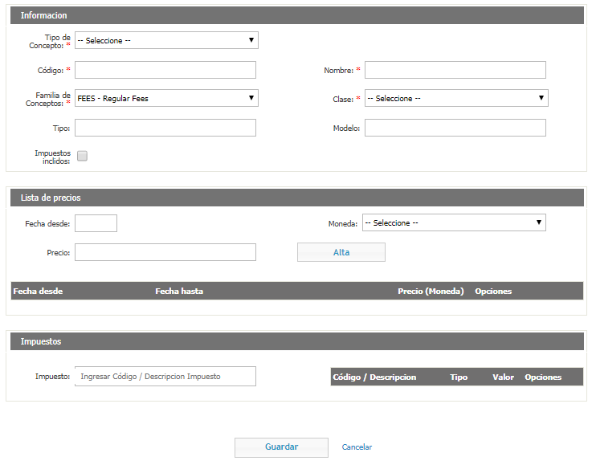

In the information section, you must fill in the following fields:

* **Concept Type**: Select if it is a Product, Discount or Commission type.
* **Code**: The concept code.
* **Name**: The name of the concept.
* **Concept Family**: Select which concept family it belongs to.
* **Class**: Select which class of concept it belongs to.
* **Type**: The type of concept.
* **Model** The concept model.
* **Taxes Included**: Tilde this option if included in the amount of the transaction.

In the price list section, you must fill in the following fields:

* **Date from**: The date on which the concept comes into effect.
* **Currency**: In what currency is the concept.
* **Price**: The price of the concept.

When you have finished filling these fields, click on "Register".

In the tax section, you must fill the Tax field with the tax code to apply to the concept.

When you have finished filling out the form, click on "Save".

#### Fast Track Configuration

?

#### Contingency

In this section, you can consult the contingencies of the Network. To make the queries easier, you have a panel of filters.

The contingencies are the transactions that were made without a pre-authorization, either because the terminal was off-line or because it did not have one.

To create a new contingency, click on the "New" button.

The fields to complete are the following:

* **Authorization Code**: The authorization code for the contingency.
* **Date**: The date of the contingency.
* **Time**: The time of the contingency.
* **Site**: The place where the contingency occurs.
* **Terminal/Controller**: The terminal/controller where the contingency occurs.
* **Primary Account**: ?
* **Secondary Account**: ?
* **Fuel**: The fuel being shipped.
* **Volume Dispatched**: The amount of fuel dispatched.
* **Unit Price**: The unit price of the shipment.
* **Dispatched Amount**: ?
* **Shift**: ?
* **Jet**: The jet from which the fuel is dispatched.
* **Odometer**: The amount of kilometers marked on the odometer of the vehicle.
* **Engine Hours**: The amount of engine hours the vehicle has.
* **Driver's Identifier**: The driver's identifier.
* **Vehicle ID**: The identifier of the vehicle.
* **Miscellaneous**: ?

#### Commercial Contracts

In ATIONet the term commerce refers to the company that owns the sites. In this section you can consult the contracts.

To create a new Company contract, click on the New button.

The fields to be completed are as follows:

* **Code**: The code you want to assign to the contract.
* **Description**: Enter a description of the contract.
* **Trade**: Select a trade.
* **Commerce User**: Enter a Commerce User.
* **Start Date**: Enter the effective date of the contract.
* **Duration** Enter the duration of the opposite.
* **Checking Account Mode**: You can select between Products or Amount.

After completing these fields, you must enter the fuel assigned to the contract, and fill in the Volume, Safety Limit, Overdraft, Overdraft Start and End Dates fields, the currency in which the Fuel Value is located, and the fuel price.

The next thing is to register different items.

The first thing is the Registration of Sites. Enter the site and it will load below, asking you to provide the price of the fuels, and the currency in which they are.

After that, you will have to fill out the Settlement Configuration form.

The fields to complete are the following:

* **Type of Billing Process**: Select the type of Billing process you want.
* **Periodicity**: ?
* **Manual**: Tilde this option if ?
* **Cutting time**: ?
* **Charges Deducted from Contract Balance**: Tilde this option if the charges are deducted from the contract balance.
* **Separate Charges Document**: ?
* **Taxpayer ID**: ?
* **Name**: ?
* **Street**: ?
* **Street 2**: ?
* **Postal Code**: ?
* **City**: ?
* **Country**: ?
* **State**: ?
* **Currency**: ?

Finally, you must fill out the Concept Registration form.

Enter a concept and then another form will be displayed.

* **Real price **: ?
* **Currency**: Select the currency in which the price is located.
* **Quantity**: ?
* **Clearing**: Tilde this option if ?
* **Liquid Event **: Select between Contract Period, Next Run of the Liquidation Process or Summary Period. ?
* **Application**: ?

Then, in the second tab, Discounts/Increases, you must fill in the following fields.

* **Class**: Select whether the concept is Discount or Increment.
* **Included**: Tilde this option if ?
* **Type**: Select if the concept is for Amount, Units, Percentage or if it is for Amount per unit.
* **Type of Rank**: Select if the type of rank is by amount or by units.
* **Staggered**: Tilde this option if ?
* **Roof Type**: Select if the roof type is by amount or by units.
* **Roof**: Enter the value of the roof.

In the Steps section you must fill in the following fields.

* **Range from**: ?
* **Range to**: ?
* **Value**: ?

When you have finished filling these fields, click on the "Add" button to register it.

#### Company Contracts

In ATIONet the term company refers to the company that owns the fleet. In this section you can consult the contracts. 

To make queries easier there is a window of applicable filters. You can filter by code, company, mode (credit or debit), description or species.

To create a new Company contract, click on the New button.

The fields to be completed are as follows:

* **Code**: The code you want to assign to the contract.
* **Mode**: You can choose whether the contract is credit or debit.
* **Description**: Enter a description of the contract.
* **Company**: Select a company.
* **Company User**: Enter a Company User.
* **Start Date**: Enter the effective date of the contract.
* **Duration** Enter the duration of the opposite.
* **Checking Account Mode**: You can select between Products or Amount.
* **Balance Mode**: You can choose between Scatter, No Scatter and Auto Fill.
* **Maximum Amount of Accounts**: Enter the maximum amount of account you will allow.
* **Validate Sites**: Check this option if you want to validate the sites.
* **Gift Card**: Tilde this option if ?

After filling these fields, you must enter the fuel assigned to the contract, and fill the fields Volume, Safety Limit, Overdraft, Start and End Dates of Overdraft, the currency in which the Fuel Value is and the fuel price.

The next thing is to register different items.

The first thing is the Registration of Sites. Enter the site and it will load below, asking you to provide the price of the fuels, and the currency in which they are.

Then, in the section "High identifiers" enter the identifiers that you want to relate to the contract.

After that, you will need to fill out the Settlement Configuration form.

The fields to complete are the following:

* **Type of Billing Process**: Select the type of Billing process you want.
* **Periodicity**: ?
* **Manual**: Tilde this option if ?
* **Cutting time**: ?
* **Charges Deducted from Contract Balance**: Tilde this option if the charges are deducted from the contract balance.
* **Separate Charge Document**: ?
* **Taxpayer ID**: ?
* **Street**: ?
* **Street 2**: ?
* **Zip Code**: ?
* **City**: ?
* **Country**: ?
* **State**: ?
* **Currency**: ?

Finally, you must fill out the Concept Registration form.

Enter a concept and then another form will be displayed.

* **Real price **: ?
* **Currency**: Select the currency in which the price is located.
* **Quantity**: ?
* **Liquid Event**: Select between Contract Period, Next Run of the Liquidation Process or Summary Period. ?
* **Application**: ?

Then, in the second tab, Discounts/Increases, you must fill in the following fields.

* **Class**: Select whether the concept is Discount or Increment.
* **Included**: Tilde this option if ?
* **Type**: Select if the concept is for Amount, Units, Percentage or if it is for Amount per unit.
* **Type of Rank**: Select if the type of rank is by amount or by units.
* **Staggered**: Tilde this option if ?
* **Roof Type**: Select if the roof type is by amount or by units.
* **Roof**: Enter the value of the roof.

In the Steps section you must fill in the following fields.

* **Range from**: ?
* **Range to**: ?
* **Value**: ?

When you have finished filling these fields, click on the "Add" button to register it.

#### Trade Checking Accounts

In this section, you can create a new Merchant Checking Account. The data to be entered are the description of the contract, the name of the trade, the trade contract and the type.

#### Company Checking Accounts

In this section, you can create a new company checking account. The data to be entered are the company description, the company name, the company contract and the type.

#### Deposits

Deposits are the physical places where identifiers are stored.

In this section, you can view the repositories created, listed by code and description. You can also edit them by clicking on the pencil icon in the options column. To create a new deposit, click on the "New" button in the "Code" column.

To create a new deposit, fill in the code and description fields and click the "Save" button.

#### Concept Families

In this section, you can consult the families of concepts created, listed by Code and Description. If you want to edit it, you can click on the pencil icon on the right.

In ATIOnet, the families of concepts are ?

To create a new concept family, click on the "New" button and fill in the Code and Description fields.

##### Requested IDs

In this section you can consult the requested identifications, request fleet identifiers and/or fidelity. You can also perform actions such as establishing the identifications as in production or as delivered.

It also has a panel to filter the requested identifications and thus make the search easier. You can filter by company name, order number, program, contract, state and/or loyalty program.

To request a fleet identifier, click on the "Request Fleet Identifiers" button. When you do, a form will open. The fields to complete are:

* **Type**: Can be Card, TAG, Chipkey, Manual Entry, ATIOnet Card or ATIOnet TAG.
* **Model**: The model. Only those with a custom track will be shown.
* **Company**: The name of the company.
* **Contract**: The contract.
* **Program**: Select the program for the identifier.
* **Quantity**: The number of identifiers.

When you have finished filling in the fields, click on the "Request IDs" button.

To request a loyalty ID, click on the "Request Loyalty IDs" button. When you do, a form will open. The fields to complete are:

* **Model**: The model of the ATIOnet Card.
* **Loyalty Program**: The loyalty program to which the requested identifier belongs.
* **Number**: The number of identifiers you want to request.

When you have finished filling in the fields, click on the "Request IDs" button.

#### Identifiers

The identifier is the physical means used by ATIONet to identify a vehicle or driver. ATIONet supports various types of identification, such as card, tag (ring), chip, ATIONet card, manual entry, barcode and iButton. When an identifier is associated to a Vehicle or Driver, a sub account is created. In this section, the identifiers already created will be shown. In the options column you can edit the identifier, enable or disable it, or release it.

####### Create a new identifier

To create a new identifier click on the new button in the upper left side.

The form to create a new identifier receives the following parameters:

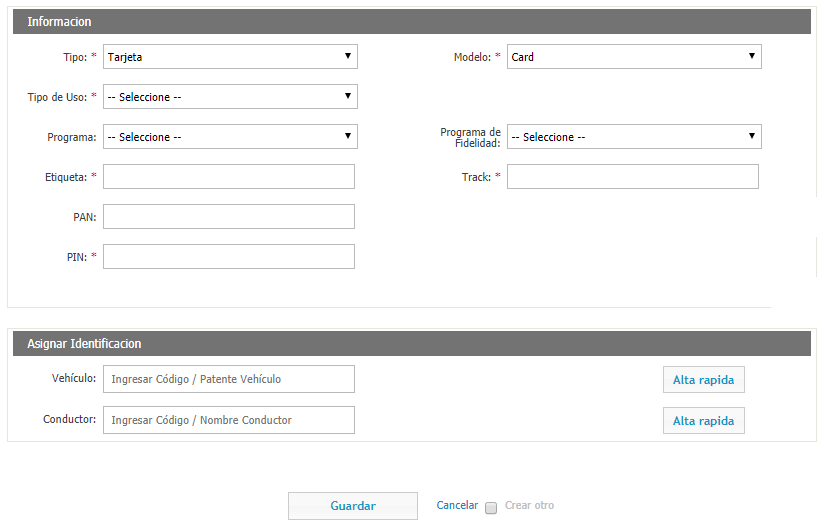

* ***Type:*** Can be Card, TAG, Chipkey, Manual Entry, ATIOnet Card or ATIOnet TAG.
* ***Model:*** The model of the type of identifier selected in ***Type***.
* ***Type of use:*** Can be fleet, loyalty or dual.
* ***Program:*** The program to which this identifier will be assigned.
* ***Loyalty program:*** The loyalty program to which this identifier will be assigned.
* ***Label:*** The name on the card (e.g. Pablo Pérez)
* ***Track:*** The track is the information that has the identifier engraved inside it. It is divided into three parts. In this field you can edit what the second field of the track contains. 
* ***PAN:*** Number of between 1 and 19 characters found in the identifier. 
* ***PIN:*** The PIN of the identifier.

Note that depending on the type of identifier, it will ask for certain items. For example, the TAG does not need a PIN. Also, if you select "Fleet" in the program type, it will not ask you to enter a loyalty program.

Secondly, the form is completed by assigning the identification to a vehicle or driver.

#### Taxes

The tax table displays:

* ***Code:***Tax Code.
* ***Description:***Tax description.
* ***Type:***Type of tax (It can be a fixed tax, a percentage tax or a fixed tax per unit).
* ***Amount:*** The amount of tax (In the case of percentage tax, the percentage).
* ***Date From / Date To:*** Range of dates.
* ***Options:*** Edit the tax.

####### Create a new tax

To create a new tax, click on the "New" button in the upper left corner.

The form to create a new tax receives the following parameters:

 

* ***Code:*** The code of the new tax.
* *** Description:*** The description of the new tax.
* ***Type:***Type of tax (Can be a fixed tax, a percentage tax or a fixed tax per unit)
* ***Date from:*** The date on which the tax takes effect.
* ***Amount:*** The amount of the tax (In the case of percentage tax, the percentage)

After filling in the fields ***Date from*** and ***Amount*** click the high button. 

When you have finished making the changes, click the "Save" button.

#### Installations

In ATIOnet, the fact that a technician places an identifier refers to Installations. 

In this section, you can consult all the installations carried out, listed by Date, Work Order, the identifiers placed, the vehicle in which the identifier was placed, the deposit from which the identifier was removed, the technician who placed it and ?

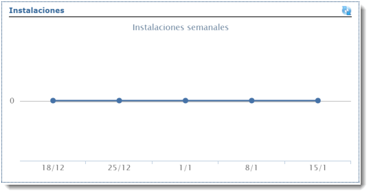

To create a new installation, click on the "New" button.

The fields you have to fill in are the following:

* **Work Order**: ?
* **Technician**: The technician who carried out the installation.
* **Company**: The company of which the vehicle to which the installation was made was a part.
* **Date**: The date on which the installation was carried out.
* **Contract**: The contract to which the vehicle is linked.
* **Vehicle**: The vehicle to which the installation was made.
* **Deposit**: The deposit is the physical place where the identifier was removed to place it.
* **Has OBD**: Tilde this option if ?

If you have OBD, more fields will be displayed:

* **ID**: Enter the OBD ID.
* **Model**: Select the OBD model.
* **Sensor**: Tilde this option if the OBD has a sensor.
* **Initial Odometer**: Enter the initial odometer.
* **Proportion**: ?

Then, in the identifiers section, enter the identifier.

When finished, click the "Save" button.

#### Payment Methods

Payment methods are the different ways in which you can pay for a purchase: cash, credit card, debit card, gift cards, etc.. ATIONET is a tool for a merchant to create their own means of payment: a fuel payment card.

####### Create a new payment method

To create a new payment method, click on the "New" button in the upper left hand corner.

The form to create a new payment method receives the following parameters:

* ***Code:*** The code of the new payment method.
* ***Description:*** The description of the new payment method.

When you have finished making the changes, click the "Save" button.

#### Identifier Models

The models of identifier vary according to the necessity of the client, they can be of type Card (A magnetic card), TAG (Ring), Chipkey or Manual Entry (A code entered by hand).

####### Create a new identifier model

To create a new model identifier, click on the "New" button located on the upper left side.

The form to create a new model identifier receives the following parameters:

* ***Type:*** Can be Card, TAG, Chipkey or Manual Entry type.
* ***Description:*** The description of the new identifier model.
* ***Installable:*** Whether it is installable or not.
* ***Personalized:*** Whether it is personalized or not.
* ***Reusable:*** Whether it is reusable or not.
* ***Supports multiple assignments:*** Whether it supports multiple assignments or not.
* ***Valid expiration date:*** Whether it validates the expiration date or not.
* ***Ignore behavior of vehicle id in terminal:***Ignore the behavior of vehicle id in terminal or not.
* ***Requires PIN:*** If you require PIN or not.

When you have finished making the changes, click the "Save" button.

#### Programs

The programs in ATIOnet are ?

To create a new program click on the "New" button.

The fields to complete are the following:

* **Description**: The description of the program.
* **Apply Contract Sites**:
* **Balance Mode**:
* **Supports contigencies**:
* **Off-line support**:
* **Gift Card**: Tilde this option if ?

####### Create a new program

To create a new program, click on the "New" button in the upper left corner.

The form to create a new program receives the following parameters:

* ***Description:*** The description of the new program.
* ***Apply Contract Sites:*** May be unaffected, forced or unforced.
* ***Balance mode:*** Can be unaffected, dispersed, undispersed, unlimited or automatic filling.
* ***Supports contingencies:*** Can be unaffected, forced or unforced.
* ***Supports offline:*** Can be unaffected, forced or unforced.
* ***Gift card:*** Whether it includes a gift card or not. If this option is checked, three more parameters will appear:
* ***Gift Card Amount:*** The amount of the gift card.
* ***Rechargeable:*** If it is rechargeable.
* ***Company:***The company to which it is assigned.

When you have finished making the changes, click the "Save" button.

#### Sites

The Site represents the service station. A site is assigned the terminal and may also have associated Location rules. This section lists the sites already entered in the system and their characteristics. In the options column you can assign a tax to the site.

##### SKUs

Stock Keeping Units (SKUs) are non-combustible products. In this section you can consult the created products, edit them by clicking on the pencil icon in the options column.

To search more easily, there is the filter panel where you can filter by certain parameters.

To create a new SKU, click on the "New" button.

The fields to complete are the following:

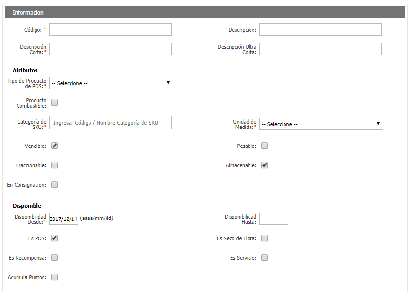

* **Code**: The SKU code.
* **Description**: The description of the SKU.
* **Short Description**: A short description of the SKU.
* **Ultra Short Description**: A very short description of the SKU.

* **POS Product Type**: Select what type of product it is.
* **Fuel Product**: Tilde this option if the SKU is a fuel product?
* **SKU Category**: Enter the category to which the SKU belongs.
* **Measurement Unit**: Enter the unit in which the SKU is measured.
* **Sellable**: Tilde this option if the SKU is sellable.
* **Weighted**: Tilde this option if the SKU is weighable.
* **Fractionable**: Tilde this option if the SKU is fractional.
* **Storeable**: Tilde this option if the SKU is storable.
* **In consignment**: Tilde this option if the SKU is in consignment.

* **Availability From/To**: Select the dates among which the SKU is available.
* **Is POS**: Tilde this option if the SKU is sold at the point of sale.
* **Dry Fleet**: Tilde this option if the SKU is a dry product.
* **Reward**: Tilde this option if the SKU can be redeemed for reward points.
* **Service**: Tilde this option if the SKU is a service.
* **Accumulate Points**: Tilde this option if the SKU accumulates points.

* **Stock Volume Min/Max Default**: ?
* **Days of Restock Default**: ?
* **Restock Default Volume**: ?

Price List.

* **Site**: Select the site to which you will charge the SKU price.
* **Date From**: Select the date on which the SKU goes into effect.
* **Price**: Indicate the price of the SKU.
* **Currency**: Select the currency in which the SKU is priced.

Items.

* **POS Code Format**: Select the point-of-sale code format.
* **POS Code**: Enter a point-of-sale code.

When you have finished filling those two fields, click the "Add" button.

* **Tax**: Enter the SKU tax code.

#### Gift Card

In this section you can consult the created gift cards. You can perform batch actions such as activating or deactivating them. To make queries easier, has a panel of filters at the top.

To create a new Gift Card, click the "New" button.

The fields to fill in to create a new gift card are the following:

* **Program**: The program to which the gift card will be associated.
* **Contract**: The contract to which the gift card will be associated.
* **Label**: The label is the inscription on the back of the card.
* **PAN**: The PAN is the number between 1 and 19 characters found on the gift card.
* **Track**: The Track is the information contained in the card, which is divided into three parts. In this field, you can customize what the second field of the track contains.
* **Type**: Select whether the gift card is a Card, TAG, Chipkey, Manual Entry, ATIOnet Card or ATIOnet TAG.
* **Model**: The model of the gift card.
* **Expiration Date**: The expiration date of the gift card.

When you have finished filling in the fields, click the "Save" button.

#### Requested Gift Cards

In this section, you can consult and request lots of gift cards.

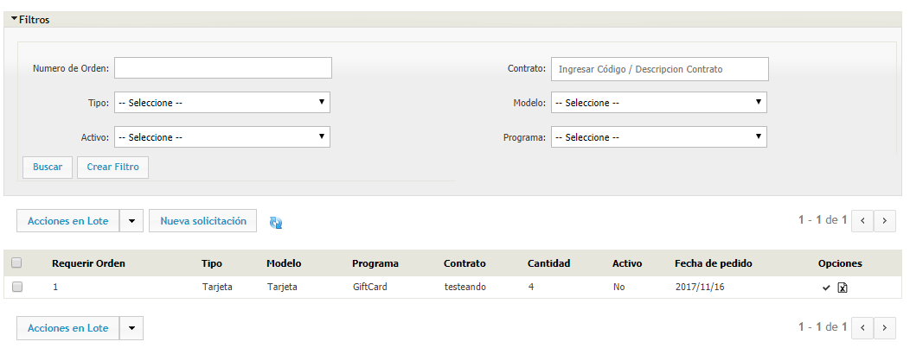

To order a new set of gift cards, click the "New Request" button.

The fields to complete are the following:

* **Program**: Select the program assigned to the batch of cards you are requesting.
* **Contract**: Select the contract of the program assigned to the batch of cards you are requesting.
* **Quantity**: Enter the number of cards you want to apply.
* **Expiration Date**: Enter the date the gift cards expire.
* **Type**: Select the type. It can be Card, TAG, Chipkey, Manual Entry, ATIOnet Card or ATIOnet TAG.
* **Model**: Select the model. It can be ATIOnet CG, Card, Magnética Dorada Card or Gift Card.

#### Unknown Transactions

Unknown transactions are those that either party (Commerce or Company) claims to be unaware of.

In this section you can consult the unknown transactions, listed by code, date, reason, state, transaction number, company, trade, site. There is also the commentary of the company, the trade and the network.

To make queries easier, this section has a panel of filters at the top.

#### Users

In this view you can consult the users of the Network. You can edit them by clicking on the pencil icon in the options column. To enable/disable a user, click on the padlock icon.

To create a new User, click on the "New" button.

The fields to complete are the following:

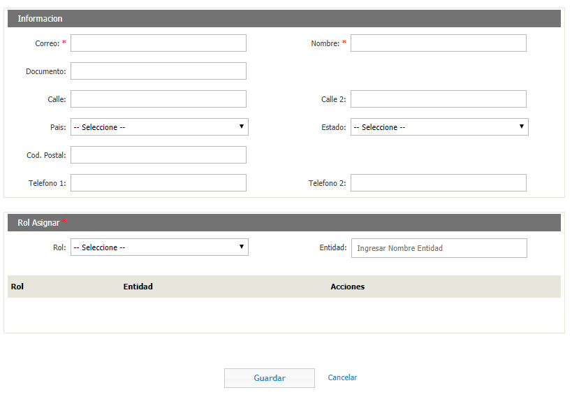

* **Email**: The user's email address.
* **Name**: The user's name.
* **Document**: The user's document.
* **Street**: The street where the user resides.
* **Street 2**: Another street of reference, as it can be the one of the corner.
* **Country**: The user's country.
* **State**: The state of the user's country.
* **Postal Code**: The postal code of the locality where the user resides.
* **Phone 1**: The user's phone.
* **Phone 2**: The user's other phone if available.

* **Role**: The role that the new user will assume.
* **Entity**: The entity assigned to the user.

