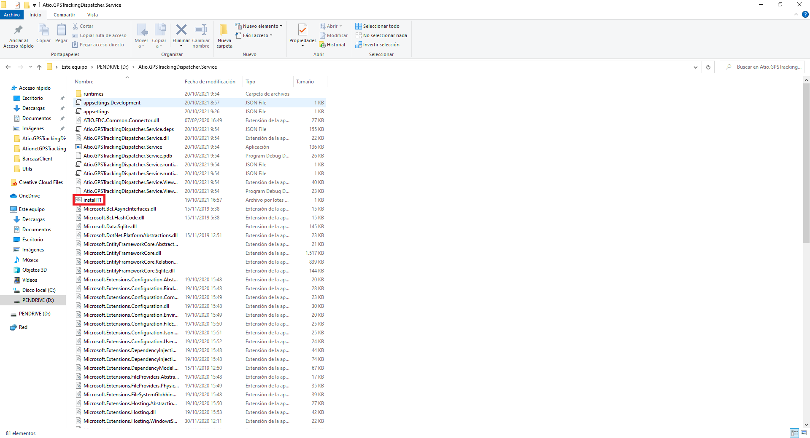
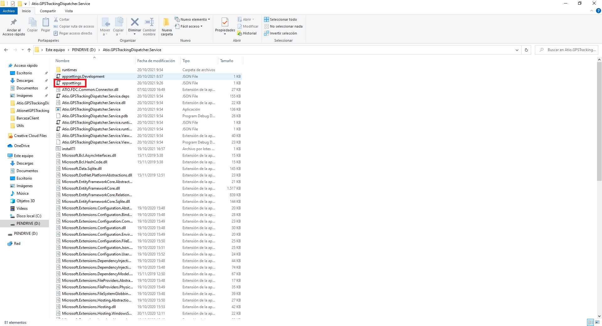
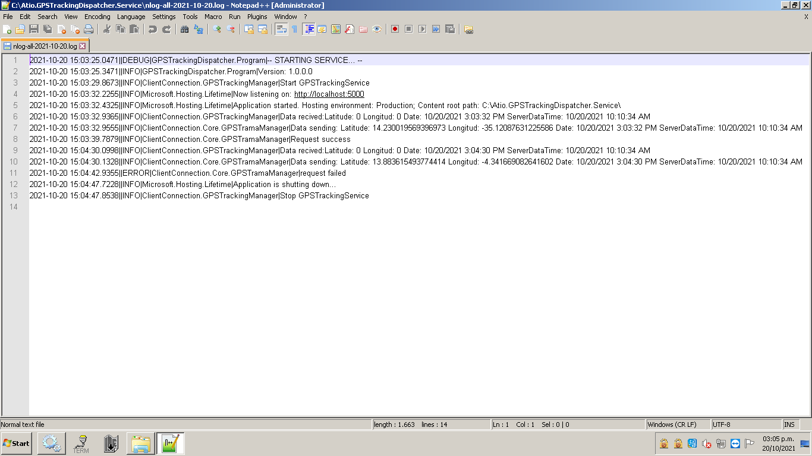

# ATIONET - GPS Tracking Dispatcher: Service installation and configuration guide

## Content ##

- [About this document](#About-this-document)
- [Requirements](#Requirements)
- [Installation](#Installation)
- [Service configuration](#Service-configuration)
- [Use of the service](#Use-of-the-service)
	- [Starting or stopping the service](#Starting-or-stopping-the-service)
	- [Service processing verification](#Service-processing-verification)

### About this document

This document details how to install the service on the Local Agent (IGPC ICO 300 or other). This will be responsible for obtaining the GPS coordinates sent by this agent through the ATIO Nano StoreAndForward service installed in it, to later send them to the ATIO server for later use.

### Requirements

This service depends on the ATIO Nano StoreAndForward service for its correct functioning. In addition, it is required that for the first time, prior to its use, a file be configured where all the environment variables necessary for its correct operation will be configured.

### Installation

For installation, we first need to copy the content folder of the service to the local agent. Next, we need to navigate to the recently copied folder, find the installation file called ‘installT1.bat’ and run it.

``` 
Note: The service will be installed to run automatically when the local agent starts.
``` 



### Service configuration

Before we use the service for the first time we need to make some changes on the configuration file: Navigate to the service content folder, find the configuration file called 'appsettings' and open it with a text editor.’



Inside of the file, we can see the following custom settings:

* **IP:** Ip address used to connect with the 'ATIO Nano StoreAndForward' service.

```
Note: If both are installed on the same local agent, the IP address will be 127.0.0.1
```

* **Port:** It will be the port in charge of listening to the 'ATIO Nano StoreAndForward' service to obtain the GPS coordinates sent by it.

* **TrackingInterval:** The time interval between GPS requests. this is expressed in milliseconds. For example, if we need 1 minute between requests, the tracking invested will be 60000

* **Url:** It will be the address of the Ationet API to which we will send our requests with the information obtained to store it.

```
The address to send the information to BETA is: https://native-beta.ationet.com/v1/tracking
The address to send the information to PRODUCCIÓN is: https://native.ationet.com/v1/tracking
```

* **Authorization:** This field will be sent in the requests of the previous point in order to authenticate the information of the user who is making the requests.

```
Important: It is necessary that the role assigned to the user is that of 'GPSInterfaceAPI' so that requests are not rejected.
Note: These data must be requested from the Ationet engineering area.
```

* **DeviceID:** This field will contain the identification number of the device linked to this service.

```
Note: These data must be requested from the Ationet engineering area.
```

Example of appsettings file

```
{
  "Logging": {
    "LogLevel": {
      "Default": "Information",
      "Microsoft": "Warning",
      "Microsoft.Hosting.Lifetime": "Information"
    }
  },
  "AllowedHosts": "*",

  "ip": "127.0.0.1", //IP to connect to the 'ATIO Nano StoreAndForward' service.
  "port": "5666", //Port to establish connection with 'ATIO Nano StoreAndForward'.
  "trackingInvertal": 5000, //Time interval between each request.
  "url": "http://native-beta.ationet.com/v1/tracking", /Address of the ationet API to store the information.
  "authorization": "Basic usuario@dominio.com:clave", //User information authenticator that makes requests to the Ationet API.
  "DeviceID": "55prueb" //Identification of the device linked to the service.
}
```

>Note: You should request your username and password from Ationet.

### Use of the service

#### Starting or stopping the service.

The service will start automatically when our local agent starts, but in addition to this, it can be stopped or started again at any time you want to do so.
To access the services section, we must open our start bar, write 'Services' in it and open our services window.


Once inside our services section, we must look for the service named ‘Atio.GPSTrackingDispatcher’. Once located, we can see its status, which can be 'Started' or be blank indicating that it is off.


If our service is off, we can make it start in the left panel, clicking the button that says 'Start she service'.


On the contrary, if it is turned on, we can turn it off from the same panel located on the left, clicking the 'Stop the service' button.


#### Service processing verification

While our service is on, it will generate records with the information of all the processes that it is carrying out, as well as errors that may occur during its execution.

In order to access these logs, we must go to the folder where our services are installed and we will look for files of the type that begin with the prefix 'nlog-all' followed by the date from which we want to check their execution.


Once we have found the record that we want to consult, we must open it with a text editor to view all the information that the service was generating in it.


