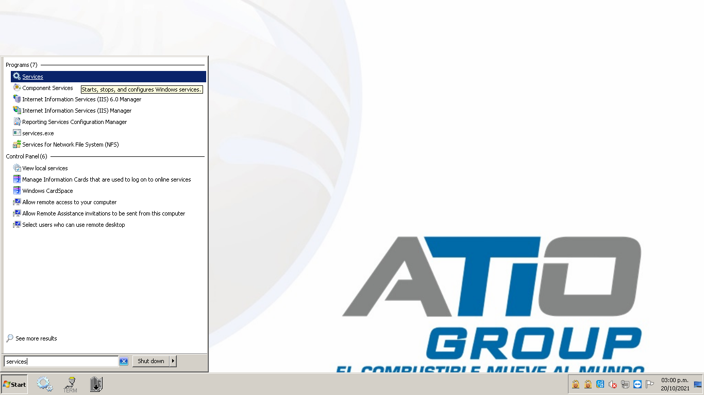
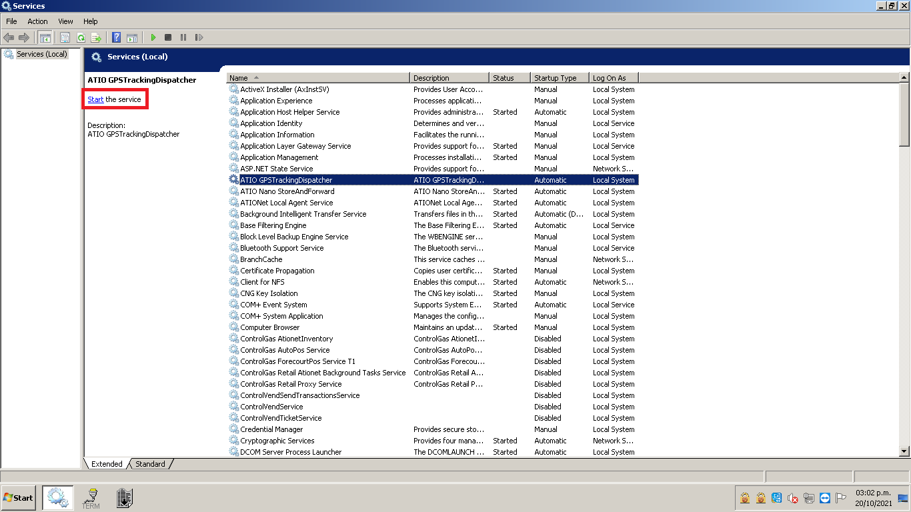
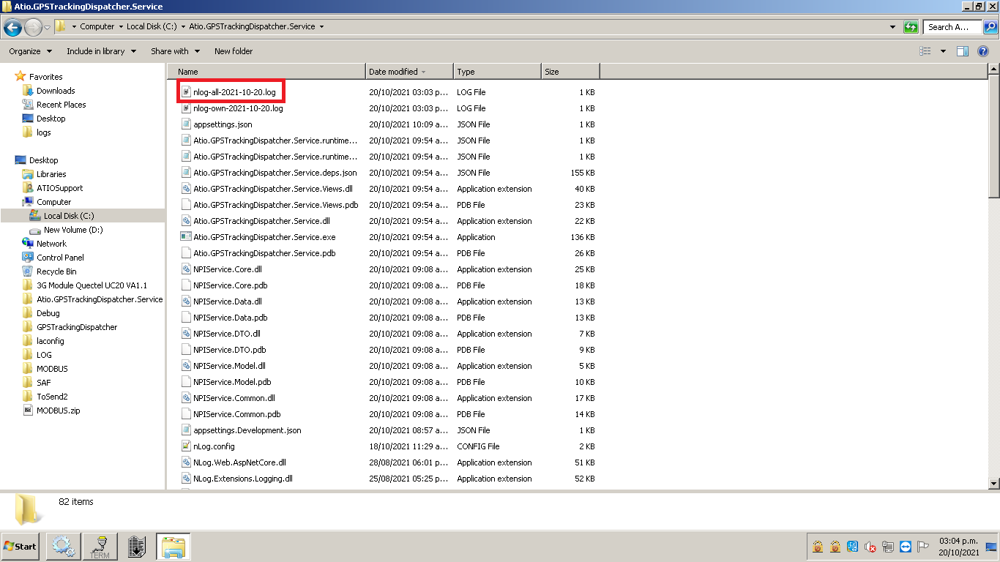

# ATIONET - GPS Tracking Dispatcher: Guia de instalación y configuración del servicio.

## Contenido ##

- [Sobre este documento](#Sobre-este-documento)
- [Requisitos](#Requisitos)
- [Instalación](#Instalación)
- [Configuración del servicio](#Configuración-del-servicio)
- [Uso del servicio](#Uso-del-servicio)
	- [Inicio o detención del servicio](#Inicio-o-detención-del-servicio)
	- [Verificación de procesamiento del servicio](#Verificación-de-procesamiento-del-servicio)


### Sobre este documento

Este documento detalla la forma de  instalación del servicio en el Local Agent (IGPC ICO 300 u otro). El mismo será el responsable de obtener las coordenadas de GPS enviadas por este agente a través del servicio ATIO Nano StoreAndForward instalado en él, para posteriormente enviarlas al servidor de ATIO para su posterior uso.

### Requisitos

Este servicio depende del servicio ATIO Nano StoreAndForward para su correcto funcionamiento. Adicionalmente se requerirá que por primera vez, previo a su uso, se configure un archivo donde se colocaran los valores de las variables de entorno necesarias para su correcto funcionamiento.

### Instalación

Para la instalación de este servicio, lo primero que necesitaremos será copiar la carpeta contenedora del mismo en nuestro Local Agent.
Luego, deberemos ingresar a la carpeta que acabamos de crear, buscar nuestro archivo de instalación llamado ‘installT1.bat’ y ejecutarlo para que realice la instalación del servicio.

``` 
Nota: Nuestro servicio se instalará para ejecutarse de manera automática cuando inicie nuestro agente local.
``` 


### Configuración del servicio

Previo a poder utilizar nuestro servicio deberemos realizar algunos cambios en nuestro archivo de configuración, para ello, deberemos dirigirnos a la carpeta desde donde ejecutamos el archivo de instalación, buscar un archivo llamado ‘appsettings’ y abrirlo con un editor de texto.


Dentro de la misma encontraremos los siguientes aspectos configurables:

* **IP:** Será la dirección ip que utilizaremos para conectarnos al servicio ‘ATIO Nano StoreAndForward’.

```
Nota: Si ambos servicios se encuentran instalados en nuestro agente local, la ip debería quedar configurada como 127.0.0.1
```

* **Port:** Sera el puerto encargado de escuchar al servicio de 'ATIO Nano StoreAndForward' para obtener las coordenadas GPS enviadas por este.

* **TrackingInterval:** Será el intervalo de tiempo entre cada request. El mismo se encuentra expresado en milisegundos. Por ejemplo, si queremos que espere un minuto entre cada petición, este campo deberá ser configurado en 60000

* **Url:** Será la dirección de la API de Ationet a la cual enviaremos nuestros request’s con la información obtenida para almacenarla.

```
La dirección para enviar la información a BETA es: https://native-beta.ationet.com/v1/tracking
La dirección para enviar la información a PRODUCCIÓN es: https://native.ationet.com/v1/tracking
```

* **Authorization:** Este campo se enviará en los request del punto anterior para poder autenticar la información del usuario que se encuentra realizando las peticiones.

```
Importante: Es necesario que el rol que tenga asignado el usuario sea el de 'CPInterfaceAPI' para que las peticiones no sean rechazadas.
Nota: Estos datos deberán ser solicitados al área de ingeniería de Ationet.
```

* **DeviceID:** Este punto contendrá el número de identificación del dispositivo vinculado a este servicio.

```
Nota: Estos datos deberán ser solicitados al área de ingeniería de Ationet.
```

Ejemplo de un archivo appsettings

```
{
  "Logging": {
    "LogLevel": {
      "Default": "Information",
      "Microsoft": "Warning",
      "Microsoft.Hosting.Lifetime": "Information"
    }
  },
  "AllowedHosts": "*",

  "ip": "127.0.0.1", //IP para conectarnos al servicio 'ATIO Nano StoreAndForward'
  "port": "5666", //Puerto para establecer la conexión con 'ATIO Nano StoreAndForward'
  "trackingInvertal": 5000, //Intervalo de tiempo entre cada request.
  "url": "http://native-beta.ationet.com/v1/tracking", //Direccion de la API de ationet para almacenar la información.
  "authorization": "Basic usuario@dominio.com:clave", //Autenticador de información de usuario que realiza las peticiones a la API de Ationet
  "DeviceID": "55prueb" //Identificación del dispositivo vinculado al servicio.
}
```

>Nota: Usted deberá solicitar su usuario y clave a Ationet.

### Uso del servicio

#### Inicio o detención del servicio.

El servicio iniciará automáticamente cuando nuestro agente local inicie, pero adicionalmente a esto, este podrá ser detenido o iniciado nuevamente en cualquier momento que se desee hacerlo. 
Para acceder al apartado de servicios deberemos abrir nuestra barra de inicio, escribir en ella ‘Services’ y abrir nuestra ventana de servicios.



Una vez dentro de nuestro apartado de servicios, deberemos buscar el servicio de nombre ‘Atio.GPSTrackingDispatcher’. Una vez localizado, podremos ver el estado del mismo, el cual puede ser ‘Started’ o estar en blanco indicando que el mismo se encuentra apagado.


Si nuestro servicio se encuentra apagado, podremos hacer que inicie en el panel izquierdo, clickeando el botón que dice ‘Start she service’.



Por el contrario, si el mismo se encontrara encendido, podremos apagarlo desde el mismo panel ubicado a la izquierda, clickeando el botón ‘Stop the service’.


#### Verificación de procesamiento del servicio

Mientras nuestro servicio se encuentre encendido, irá generando registros con la información de todos los procesos que se encuentra realizando, como así también errores que puedan ocurrir durante su ejecución.

Para poder acceder a estos registros, deberemos dirigirnos a la carpeta donde se encuentra instalado nuestro servicios y buscaremos los archivos del tipo que comiencen con el prefijo ‘nlog-all” seguido de la fecha de la cual queremos consultar su ejecución.



Una vez encontrado el registro que deseamos consultar, deberemos abrirlo con un editor de texto para visualizar toda la información que el servicio fue generando en el.


