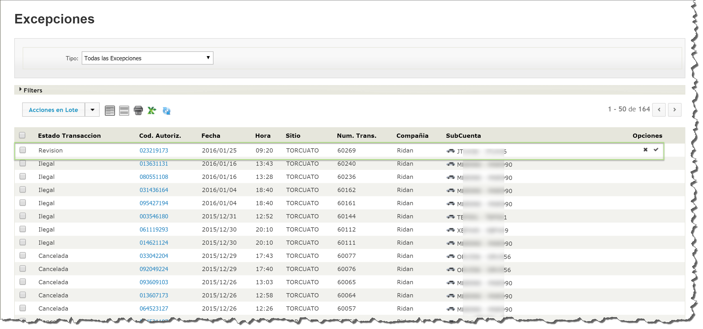
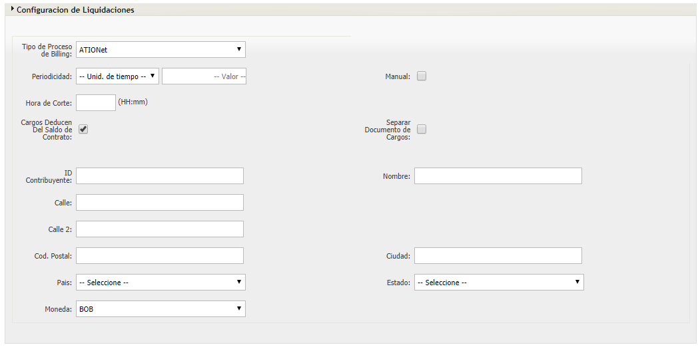
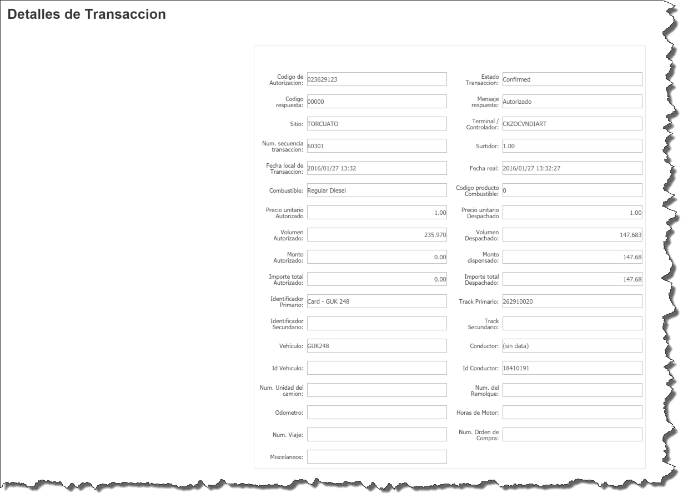
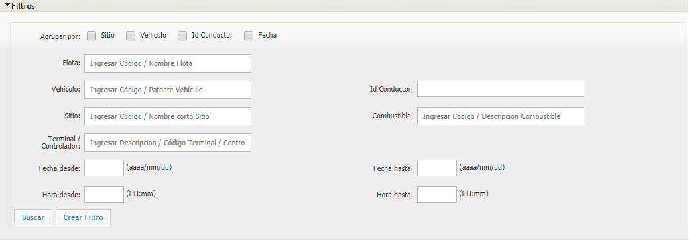
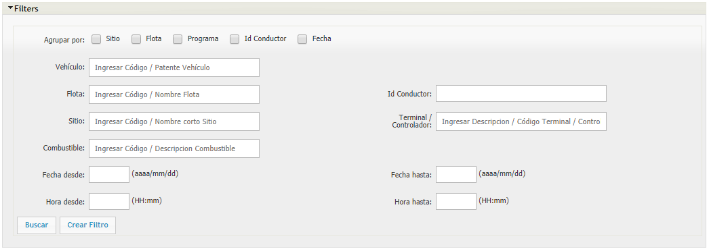
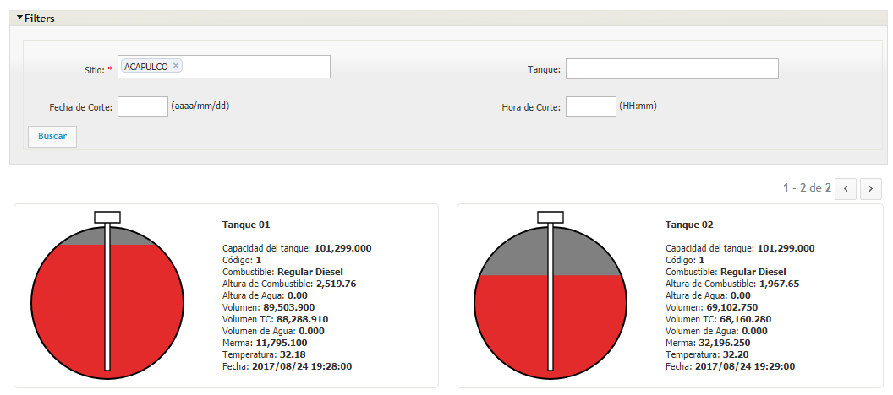

|**Document Information**|.|
|--- |--- |
|**File:**|ATIONet_Network_User_Manual-EN.md|
|**Doc Version:**|2.0|
|**Release Date:**|14, May 2021|
|**Author:**|ATIONet LLC|

|**Change Log**|||
|--- |--- |--- |
|**Ver.**|**Date**|**Change Summary**|
|1.0|02/Aug/2017|- Initial version
|2.0|14/May/2021|- Manual update

# Contents

- [Overview](#overview)
- [Definitions](#definitions)
	- [Contract](#contract) 
	- [Sub-account](#sub-account)
	- [Company](#company)
	- [Identification](#identification)
	- [Site](#site)
	- [Vehicle](#vehicle)
	- [Driver](#driver)
	- [Offline module](#offline-module)
	- [Terminal](#terminal)
- [Navigation Menu](#navigation-menu)
	- [DashBoard](https://github.com/Ationet/ationetdocs/blob/master/UserManuals/ATIONet_Network_User_Manual-EN-Modules/DashBoard.md)
		- [Health Status](https://github.com/Ationet/ationetdocs/blob/master/UserManuals/ATIONet_Network_User_Manual-EN-Modules/DashBoard.md)
		- [Units/Months](https://github.com/Ationet/ationetdocs/blob/master/UserManuals/ATIONet_Network_User_Manual-EN-Modules/DashBoard.md)
		- [Today’s Transactions](https://github.com/Ationet/ationetdocs/blob/master/UserManuals/ATIONet_Network_User_Manual-EN-Modules/DashBoard.md)
		- [List of Outstanding Pre-Authorizations](https://github.com/Ationet/ationetdocs/blob/master/UserManuals/ATIONet_Network_User_Manual-EN-Modules/DashBoard.md)
		- [Flagged Transactions Current Month](https://github.com/Ationet/ationetdocs/blob/master/UserManuals/ATIONet_Network_User_Manual-EN-Modules/DashBoard.md)
		- [List of Outstanding Pre-Authorizations](https://github.com/Ationet/ationetdocs/blob/master/UserManuals/ATIONet_Network_User_Manual-EN-Modules/DashBoard.md)
		- [Sub-Accounts with Exceptions](https://github.com/Ationet/ationetdocs/blob/master/UserManuals/ATIONet_Network_User_Manual-EN-Modules/DashBoard.md)
		- [Recent Transactions](https://github.com/Ationet/ationetdocs/blob/master/UserManuals/ATIONet_Network_User_Manual-EN-Modules/DashBoard.md)
		- [Contract Low Balance Listing](https://github.com/Ationet/ationetdocs/blob/master/UserManuals/ATIONet_Network_User_Manual-EN-Modules/DashBoard.md)
		- [Sub-Account Low Balance Listing](https://github.com/Ationet/ationetdocs/blob/master/UserManuals/ATIONet_Network_User_Manual-EN-Modules/DashBoard.md)
		- [Last Month Identification Updates](https://github.com/Ationet/ationetdocs/blob/master/UserManuals/ATIONet_Network_User_Manual-EN-Modules/DashBoard.md)
		- [Terminal status](https://github.com/Ationet/ationetdocs/blob/master/UserManuals/ATIONet_Network_User_Manual-EN-Modules/DashBoard.md)
	- [Favorites](https://github.com/Ationet/ationetdocs/blob/master/UserManuals/ATIONet_Network_User_Manual-EN-Modules/Favorites%20%26%20Reports.md)
	- [Reports](https://github.com/Ationet/ationetdocs/blob/master/UserManuals/ATIONet_Network_User_Manual-EN-Modules/Favorites%20%26%20Reports.md)
		- [Driver](https://github.com/Ationet/ationetdocs/blob/master/UserManuals/ATIONet_Network_User_Manual-EN-Modules/Favorites%20%26%20Reports.md)
		- [Transactions](https://github.com/Ationet/ationetdocs/blob/master/UserManuals/ATIONet_Network_User_Manual-EN-Modules/Favorites%20%26%20Reports.md)
		- [Vehicle](https://github.com/Ationet/ationetdocs/blob/master/UserManuals/ATIONet_Network_User_Manual-EN-Modules/Favorites%20%26%20Reports.md)
	- [Administration](https://github.com/Ationet/ationetdocs/blob/master/UserManuals/ATIONet_Network_User_Manual-EN-Modules/Administration.md)
		- [Brands](https://github.com/Ationet/ationetdocs/blob/master/UserManuals/ATIONet_Network_User_Manual-EN-Modules/Administration.md)
		- [Companies](https://github.com/Ationet/ationetdocs/blob/master/UserManuals/ATIONet_Network_User_Manual-EN-Modules/Administration.md)
		- [Companies Groups](https://github.com/Ationet/ationetdocs/blob/master/UserManuals/ATIONet_Network_User_Manual-EN-Modules/Administration.md)
		- [Companies Groups – Movements](https://github.com/Ationet/ationetdocs/blob/master/UserManuals/ATIONet_Network_User_Manual-EN-Modules/Administration.md)
		- [Drivers](https://github.com/Ationet/ationetdocs/blob/master/UserManuals/ATIONet_Network_User_Manual-EN-Modules/Administration.md)
		- [Fuels](https://github.com/Ationet/ationetdocs/blob/master/UserManuals/ATIONet_Network_User_Manual-EN-Modules/Administration.md)
		- [Fuels Masters Groups](https://github.com/Ationet/ationetdocs/blob/master/UserManuals/ATIONet_Network_User_Manual-EN-Modules/Administration.md)
		- [Gift Card](https://github.com/Ationet/ationetdocs/blob/master/UserManuals/ATIONet_Network_User_Manual-EN-Modules/Administration.md)
		- [Gift Cards Request](https://github.com/Ationet/ationetdocs/blob/master/UserManuals/ATIONet_Network_User_Manual-EN-Modules/Administration.md)
		- [Identifications](https://github.com/Ationet/ationetdocs/blob/master/UserManuals/ATIONet_Network_User_Manual-EN-Modules/Administration.md)
		- [Identifications Models](https://github.com/Ationet/ationetdocs/blob/master/UserManuals/ATIONet_Network_User_Manual-EN-Modules/Administration.md)
		- [Identifications Providers](https://github.com/Ationet/ationetdocs/blob/master/UserManuals/ATIONet_Network_User_Manual-EN-Modules/Administration.md)
		- [Installations](https://github.com/Ationet/ationetdocs/blob/master/UserManuals/ATIONet_Network_User_Manual-EN-Modules/Administration.md)
		- [Merchants](https://github.com/Ationet/ationetdocs/blob/master/UserManuals/ATIONet_Network_User_Manual-EN-Modules/Administration.md)
		- [Notifications](https://github.com/Ationet/ationetdocs/blob/master/UserManuals/ATIONet_Network_User_Manual-EN-Modules/Administration.md)
		- [Payment Methods](https://github.com/Ationet/ationetdocs/blob/master/UserManuals/ATIONet_Network_User_Manual-EN-Modules/Administration.md)
		- [Quotations](https://github.com/Ationet/ationetdocs/blob/master/UserManuals/ATIONet_Network_User_Manual-EN-Modules/Administration.md)
		- [Rack Prices](https://github.com/Ationet/ationetdocs/blob/master/UserManuals/ATIONet_Network_User_Manual-EN-Modules/Administration.md)
		- [Sites](https://github.com/Ationet/ationetdocs/blob/master/UserManuals/ATIONet_Network_User_Manual-EN-Modules/Administration.md)
		- [SKUs](https://github.com/Ationet/ationetdocs/blob/master/UserManuals/ATIONet_Network_User_Manual-EN-Modules/Administration.md)
		- [SKUs categories](https://github.com/Ationet/ationetdocs/blob/master/UserManuals/ATIONet_Network_User_Manual-EN-Modules/Administration.md)
		- [Taxes](https://github.com/Ationet/ationetdocs/blob/master/UserManuals/ATIONet_Network_User_Manual-EN-Modules/Administration.md)
		- [Terminals / Controllers](https://github.com/Ationet/ationetdocs/blob/master/UserManuals/ATIONet_Network_User_Manual-EN-Modules/Administration.md)
		- [Users](https://github.com/Ationet/ationetdocs/blob/master/UserManuals/ATIONet_Network_User_Manual-EN-Modules/Administration.md)
		- [Vehicle](https://github.com/Ationet/ationetdocs/blob/master/UserManuals/ATIONet_Network_User_Manual-EN-Modules/Administration.md)
		- [Vouchers](https://github.com/Ationet/ationetdocs/blob/master/UserManuals/ATIONet_Network_User_Manual-EN-Modules/Administration.md)
		- [Warehouses](https://github.com/Ationet/ationetdocs/blob/master/UserManuals/ATIONet_Network_User_Manual-EN-Modules/Administration.md)
		- [Zones](https://github.com/Ationet/ationetdocs/blob/master/UserManuals/ATIONet_Network_User_Manual-EN-Modules/Administration.md)
	- [Fleets](#fleets)
		- [Attendants](#attendants)
		- [Company Contracts](#company-contracts)
		- [Company Current Accounts](#company-current-accounts)
		- [Concepts](#concepts)
		- [Concept Families](#concept-families)
		- [Contingency](#contingency)
		- [Declined Transactions](#declined-transactions)
		- [Dispensed Transactions](#dispensed-transactions)
		- [Disputed Transactions](#disputed-transactions)
		- [Exceptions](#exceptions)
		- [Fast Track Configuration](#fast-track-configuration)
		- [Fraud Alerts](#fraud-alerts)
		- [Fraud Alerts Configuration](#fraud-alerts-configuration)
		- [Generation of Vouchers](#generation-of-vouchers)
		- [Invoice Type](#invoice-type)
		- [Invoices](#invoices)
		- [Merchants Contracts](#merchants-contracts)
		- [Merchant Current Accounts](#merchant-current-accounts)
		- [Outstanding Authorizations](#outstanding-authorizations)
		- [Over Limit](#over-limit)
		- [Programs](#programs)
		- [Requested Identifications](#requested-identifications)
		- [Rules](#rules)
		- [Transactions](#transactions-1)
		- [Transactions by Driver](#transactions-by-driver)
		- [Transactions by Fleet](#transactions-by-fleet)
		- [Transactions by Site](#transactions-by-site)
		- [Transactions by Vehicle](#transactions-by-vehicle)
		- [Uncontrolled Transactions](#uncontrolled-transactions)
	- [Billing](#billing)
		- [Billed Items](#billed-items)
		- [Billing Documents](#billing-documents)
		- [Billing Processes](#billing-processes)
		- [Billing Types Configuration](#billing-types-configuration)
		- [Charges Documents](#charges-documents)
		- [Statements](#statements)
	- [Notifications](#notifications-1)
		- [Alert Rules](#alert-rules)
		- [Notification Formats](#notification-formats)
		- [Notifications](#notifications-2)
	- [Configuration](#configuration)
		- [Company Contracts Classifications](#company-contracts-classifications)
		- [Contingencies Reasons](#contingencies-reasons)
		- [Network](#network)
		- [Process Configuration](#process-configuration)
		- [Sites Classification](#sites-classification)
	- [Logs](#logs)
		- [Audit Log](#audit-log)
		- [Process History](#process-history)
- [My Filters](#my-filters)
- [My Preferences](#my-preferences)
- [Inventory](#inventory)
  - [Inventory Chart](#inventory-chart)
  - [Inventory](#inventory-1)
  - [Deliveries](#deliveries)
  - [Inventory Reconciliation](#inventory-reconciliation)

# Overview

ATIONet is based on the premise that online communications between sites and the web portal are possible, however, it provides solid contingency procedures in the event of a communication error.

The ATIONet platform is a fleet management service with an innovative and unique market offer. Cloud processing, 100% web-based, multi-user access, data availability and sharing, instant updates, security, automatic back-up and paperwork reduction.

ATIONet is a web portal for fleet service companies that allows the processing of transactions from any point of sale application through a simple and reliable interface. 

ATIONet can be installed at any service station with one or multiple fleet service programs. The web portal allows fleet managers full access to their vehicle information.

ATIONet makes it possible for the fleet manager to operate, monitor, change and edit fleet information in real time.

# Definitions

## Contract 

The contract is the relationship that exists between the network and the client, in which it is guided, for example, if it will be of amount or volume, the price at which the fuel is going to be sold, in which sites it can load, among others.

## Sub-account 

Each time an identification is associated with a vehicle or driver, a sub-account is created. The sub-account is definitely who is going to have a current account, the sub-account is going to be able to receive deposits of money or product. The rules also impact the sub-account.

The sub-accounts are hierarchically dependent on the contract.

## Company

In ATIONet the company refers to the entity that owns the fleet. It is the one that manages the vehicles, drivers and fleet rules.

## Identification

The identification is the physical means used by ATIONet to identify a vehicle or driver. ATIONet supports various types of identifications, such as card, TAG, chip, ATIONet card, manual entry, barcode and iButton. When an identification is associated to a Vehicle or Driver, a sub-account is created.

## Site 

The Site represents the service station. A site is assigned a terminal/controller and may also have associated Location rules.

## Vehicle 

The vehicles can be associated or grouped by a fleet, they can have associated rules and at the moment of being related with an identification a sub-account is created. They may also have an associated driver.

## Driver 

The driver in ATIONet is the person who is identified as a chauffeur. If this driver is assigned an identification, a sub-account is created. Drivers may also have associated rules.

## Offline module 

ATIONet's offline module is automatically activated when the service station has no Internet connection and the authorizations cannot be processed online. At this point the offline module comes into play. For the terminal/controller it is completely transparent. When the offline module recovers the connectivity it sends all the information processed locally and also downloads any updates. As long as there is connectivity, the offline module is continuously downloading ATIONet updates (balances, identifications, rules, etc).

## Terminal

The terminal (or controller) is the representation of the dispenser controller, which needs to be parameterized in a particular way according to the type of terminal. The terminals handled by ATIONet are ATIO-NanoCPI, ATIO-Standalone, ATIO-CG, VF-Sapphire, VF-Commander, VF-Ruby, ControlGas, among others. 

# Navigation Menu

ATIONet has a quick access menu located on the left side of the website. From this menu you can access different options. The menu is divided into 9 sections. (Dashboard, Favorites, Reports, Administration, Fleets, Billing, Notifications, Configuration and Logbook).

 
 
 

# Fleets

## Attendants
In ATIONet the term attendant refers to the person responsible to make the dispatch, that operates the pumps. In this section you can view, create and edit all attendants.

To create an attendant, click the **New** button.

## Company Contracts
In ATIONet the term company refers to the entity that manages the fleet. In this section you can create, edit or consult all company contracts.

To make queries easier, there is a filter panel on the top. You can filter by code, company, mode (credit or debit), description, etc.

To create a company contract, click the **New** button.

The first step to create a new contract is filling out the general information:

* **Active:** Checkmark this option to enable/disable the contract.
* **Code**: Input the code associated to the contract.
* **Company**: Select the company associated to the contract
* **Reactivation amount:** Input the minimum amount required for automatic reactivation (if the contract is disabled and a deposit was made for that amount or higher).
* **Description**: Input the description of the contract.
* **Start Date**: Input the starting date of the contract.
* **Duration** Input the duration of the contract.
* **Current Account Mode**: Select the current account mode associated to the contract (Product or Money).
* **Currency:** Select the currency associated to the contract (this option is only enabled if the **current account mode** is **Money**).
* **Mode**: Select the contract mode (Credit, Debir or Cash).
* **Limit:** Input the credit limit associated to the contract.
* **Balance Mode**: Select the balance mode associated to the contract:
	* ***Disperse:*** The balance is managed on a sub-account level.
	* ***Do not Disperse:*** The balace is managed on a contract level.
	* ***Auto Fill:*** There is no balance.
* **Site Validation:** Checkmark this option to enable/disable site validation (the contract can only operate within the sites assigned).
* **Validate Fuels:** Checkmark this option to enable/disable fuel validation (the contract can only operate with fuels assigned).
* **Use Rack Prices:** Checkmark this option to enable/disable the usage of rack prices (the contract will only use rack prices when there are no prices configured in the contract).
* **Validate Programs:**
* **Subsidized Values:**

Once the general information is completed, you have different tabs to configure:

1. **Fuels:** Select the fuels associated to the contract.

2. **Sites:** Select the sites associated to the contract.

3. **Prices:** Configure prices associated to the contract.

* ***Fuel:*** Select the fuel associated to the price.
* ***Value:*** Input the price value.
* ***Site:*** Select the site associated to the price.
* ***Date From:*** Input the starting date of the price.
* ***Time From:*** Input the starting time of the price.
* ***Date To:***  Input the ending date of the price.
* ***Time To:*** Input the ending time of the price.

4. **Modifiers:** Configure modifiers associated to the contract.

* ***Description:*** Input the modifier description.
* ***Class:*** Select the modifier class (Discount or Recharge).
* ***Type:*** Select the modifier type (Percentual, Fixed per Transaction or Fixed per Unit).
* ***Value:*** Input the modifier value.
* ***Fuel:*** Select the fuel associated to the modifier.
* ***Site:*** Select the site associated to the modifier.
* ***Date From:*** Input the starting date of the modifier.
* ***Time From:*** Input the starting time of the modifier.
* ***Date To:***  Input the ending date of the modifier.
* ***Time To:*** Input the ending time of the modifier.

5. **Billing:** Configure the billing process associated to the contract.

* ***Process Billing Type:*** Select the process billing type associated to the contract (EdiFactMx is for Mexico client only)
* ***Active:*** Checkmark this option to enable/disble the billing process.
* ***Due Days:*** Input the amount of expiration days associated to the statement.
* ***Periodicity:*** Input the frequency in which statements are generated.
* ***Manual:*** Checkmarck this option to enable/disable the manual process of the billing process.
* ***Charges Deduct Balance from Accounts:*** Checkmark this option to enable/disable ATIONet from automatically substracting concepts from accounts balances.
* ***Separate Charges Document:*** Checkmark this option to enable/disable ATIONet from separating each concept associated to the statement.
* ***Recipient Emails:*** Input the emails addresses that will receive the statements.
* ***Tax Payer Id:*** Input the tax payer id associated to the statement.
* ***Name:*** Input the name associated to the statement.
* ***Street 1:*** Input the primary street associated to the statement.
* ***Street 2:*** Input the secobndary street associated to the statement.
* ***Zip Code:*** Input the zip code associated to the statement.
* ***City:*** Input the city associated to the statement.
* ***Country:*** Input the country associated to the statement.
* ***State:*** Input the state associated to the statement.

6. **Concepts:** Select the concept associated to the contract. For more information on concepts access [here]().

	
7. **Documents:** Upload any document associated to the contract (for example: a pdf of the actual physical contract).

8. **Blocks:** Configure the blocks associated to the contract

* ***Type:*** Select **Fixed** to block operation on specific dates, or select **Fixed** to block operation on specific days of every month. 
* ***Date From:*** Input the starting date of the block.
* ***Date To:*** Input the ending date of the block.
* ***Day From:*** Input the starting day of every month for the block.
* ***Day To:*** Input the ending day of every moth for the block.

9. **Over Limit:** Configure the overlimits associated to the contract.

* ***Type:*** Select the over limit type (Percent or Amount).
* ***Value:*** Input the value associated to the over limit.
* ***Date From:*** Input the starting date of the over limit.
* ***Date To:*** Input the ending date of the over limit.

10. **Programs:**
11. **Subsidies:**
12. **Custom Fields:**

### Company Current Accounts
The Company Current Accounts section is the view of available balance of sub-account and/or contracts, and also the view of all movements of sub-accounts and/or contracts.

For easier quieries there is a filter panel available. The first option in the filter panel is the type of report:

1. **Contract List:** This option lists all contracts with their respective balance, but does not give details of the movements.

2. **Contract Movements:** This option lists all contract movements.

3. **Sub-account List:** This option lists all sub-accounts with their respective balances, but does not give details of the movements.

4. **Sub-account Movements:** This view lists all sub-account movements.  

### Concepts
Concepts in ATIONet refer to taxes or commission fees that can be added to company or merchant contracts. In this section you can consult, create and edit concepts.

To create a concept, click the **New** button.

The fields to complete are the following:

* **Concept Type**: Select the concept type (Product, Discount or Fee).
* **Code**: Input the concept unique code.
* **Name**: Input the concept name.
* **Concept Family**: Select the family associated to the concept.
* **Class**: Select the call associated to the concept.
* **Type**: Input the concept type.
* **Model** Input the concept model.
* **Taxes Included**: Checkmark this option if the taxes are included in the amount of the transaction.

In the pricebook section fill in the following fields:

* **Date From**: Input the starting date of the concept.
* **Currency**: Input the currency of the concept.
* **Price**: Input the price of the concept.

### Concept Families
Concept Families in ATIONet is just a way to group up several concepts. In this section you can consult, create or edit family concepts.

To create a concept family, click  the **New** button.

### Contingency
In ATIONet a contingency is a manually entered transaction. In this section you can consult and create contingencies. Take into account that contingencies are transactions without a pre-authorization.

To create a contingency, click the **New** button.

The fields to complete are the following:

* **Date:** Input the date of the contingency.
* **Time:** Input the time of the contingency.
* **Site:** Select the site associated to the contingency.
* **Terminal/Controller:** Select the terminal/controller associated to the contingency.
* **Primary Account:** Select the primary sub-account associated to the contingency.
* **Secondary Account:** Select the secondary sub-account associated to the contingency.
* **Fuel:** Select the fuel associated to the contingency.
* **Dispensed Volume:** Input the volume associated to the contingency.
* **Unit Price:** Input the unit price associated to the contingency.
* **Dispensed Amount:** Input the amount associated to the contingency.
* **Shift Number:** Input the shift associated to the contingency.
* **Pump Number:** Input the pump associated to the contingency.
* **Odometer:** Input the vehicle's odometer associated to the contingency.
* **Engine Hours:** Input the vehicle's engine hours associated to the contingency.
* **Driver Id:** Input the the driver's identifier associated to the contingency.
* **Vehicle Id:** Input the vehicle's identifier associated to the contingency.
* **Attendant:** Input the attendant associated to the contingency.
* **Pump Side:** Input the pump side associated to the contingency.
* **Miscellaneous:** Input the vehicle's miscellaneous associated to the contingency.
* **Invoice Number:** Input the invoice number associated to the contingency.
* **Purchase Order Number:** Input the purchase orden number associated to the contingency.

### Declined Transactions
ATIONet separates unauthorized transactions into 2 sections, [Excepciones](#excepciones)and Rejected Transactions.
Rejected Transactions are those transactions that managed to pass ATIONet's hard validations but were rejected by other validations such as an unsatisfied rule or balance validation.

In the Rejected Transactions view we can filter by the type of rejection first. The types of rejections available are as follows:

This view also has the filter panel mentioned above. It is worth highlighting the ***"Offline Transactions "*** filter, by checking this option, it will also show those transactions that were marked as rejected in the Offline module. 
(for more details about the Offline module see this [sección](#modulo-offline))

Once you select the filters, press ***"Search "*** and all transactions marked as rejected will be listed.

It should be clarified that there is a possibility that a transaction may be rejected but that the fuel has been delivered. This occurs when the rejection occurs in the termination transaction.
Some of the most common reasons for this situation are the following:

* The pre authorization is expired (more than 3hs between the date of creation of the pre authorization and the date of creation of the termination. This is not related to the time it may take for the termination to arrive in offline mode).
* There is no existing pre-authorization for that transaction.
* The pre-authorization was cancelled manually.
* The termination transaction contains invalid information (errors in the terminal or controller).
* The termination transaction was executed with errors on the host.
* The termination transaction contains different information than the pre-authorization information, such as for example.
* The termination transaction reports more volume or amount than was authorized. In this case the authorization can be approved.

### Dispensed Transactions
### Disputed Transactions
Disputed transactions are those that either party (Commerce or Company) claims to be unaware of.

In this section you can consult the disputed transactions, listed by code, date, reason, state, transaction number, company, trade, site. There is also the commentary of the company, the trade and the network.

To make queries easier, this section has a panel of filters at the top.

### Exceptions
ATIONet separates unauthorized transactions into 2 sections, Exceptions and [Transacciones Rechazadas](#transacciones-rechazadas).
Exceptions are those transactions that did not pass the hard validations of the system or those that are detected as possible frauds.

In the Exceptions view we can filter by Exception type first. The types of Exceptions available are as follows:

This view also has the filter panel mentioned above. It is worth highlighting the ***"Offline Transactions "*** filter, by checking this option, it will also show those transactions that were marked as Exceptions in the Offline module. 
(for more details about the Offline module see this [sección](#modulo-offline))

Once you have selected the filters, press ***"Search "***" and all transactions marked as Exceptions will appear in the list.

Some transactions remain in "Review" status in some situations, such as when more than authorized is sent (due to a controller or POS error). In these cases it is necessary to approve or reject the transaction using one of the two icons to the right of each record.

### Fast Track Configuration
?

### Fraud Alerts
### Fraud Alerts Configuration
### Generation of Vouchers
### Invoice Type
### Invoices
### Merchants Contracts
In ATIONet the term commerce refers to the company that owns the sites. In this section you can consult the contracts.

To create a new Company contract, click on the New button.

The fields to be completed are as follows:

* **Code**: The code you want to assign to the contract.
* **Description**: Enter a description of the contract.
* **Trade**: Select a trade.
* **Commerce User**: Enter a Commerce User.
* **Start Date**: Enter the effective date of the contract.
* **Duration** Enter the duration of the opposite.
* **Checking Account Mode**: You can select between Products or Amount.

After completing these fields, you must enter the fuel assigned to the contract, and fill in the Volume, Safety Limit, Overdraft, Overdraft Start and End Dates fields, the currency in which the Fuel Value is located, and the fuel price.

The next thing is to register different items.

The first thing is the Registration of Sites. Enter the site and it will load below, asking you to provide the price of the fuels, and the currency in which they are.

After that, you will have to fill out the Settlement Configuration form.

The fields to complete are the following:

* **Type of Billing Process**: Select the type of Billing process you want.
* **Periodicity**: ?
* **Manual**: Tilde this option if ?
* **Cutting time**: ?
* **Charges Deducted from Contract Balance**: Tilde this option if the charges are deducted from the contract balance.
* **Separate Charges Document**: ?
* **Taxpayer ID**: ?
* **Name**: ?
* **Street**: ?
* **Street 2**: ?
* **Postal Code**: ?
* **City**: ?
* **Country**: ?
* **State**: ?
* **Currency**: ?

Finally, you must fill out the Concept Registration form.

Enter a concept and then another form will be displayed.

* **Real price **: ?
* **Currency**: Select the currency in which the price is located.
* **Quantity**: ?
* **Clearing**: Tilde this option if ?
* **Liquid Event **: Select between Contract Period, Next Run of the Liquidation Process or Summary Period. ?
* **Application**: ?

Then, in the second tab, Discounts/Increases, you must fill in the following fields.

* **Class**: Select whether the concept is Discount or Increment.
* **Included**: Tilde this option if ?
* **Type**: Select if the concept is for Amount, Units, Percentage or if it is for Amount per unit.
* **Type of Rank**: Select if the type of rank is by amount or by units.
* **Staggered**: Tilde this option if ?
* **Roof Type**: Select if the roof type is by amount or by units.
* **Roof**: Enter the value of the roof.

In the Steps section you must fill in the following fields.

* **Range from**: ?
* **Range to**: ?
* **Value**: ?

When you have finished filling these fields, click on the "Add" button to register it.

### Merchant Current Accounts
The trade current accounts view is the view where the balances and movements of the trades are consulted.
In ATIONet the term trade refers to the company that owns the sites.

This view has, like the rest of the views, a panel of filters.
The first option in the panel is the type of report we want to see.

### Outstanding Authorizations
Pending authorizations are those transactions that have not yet received the completion transaction. The records seen in this view are dispatched that are currently underway. If for some reason there are old pre-authorizations, it is likely that the POS did not send the completion transaction or the cancellation transaction if the dispatch was not completed.

Please note that at the time of pre-authorization, ATIONet froze the amount of the authorization of the current account of the sub-account.
This view presents all the fields necessary to identify the transaction and the vehicle. If you need to see more details, clicking on the authorization code will take you to the transaction details view.

If old pending transactions appear and you are sure it is not an ongoing dispatch, you may cancel them and return the balance to the current account.
To do this you have 2 ways, individually, by clicking on the **X** icon to the right side of the grid, or massively by selecting the transactions, displaying the **Batch Actions** menu and selecting "Cancel". This will cancel the transactions and return the balance to each of the current accounts.

(for more details on the transaction flow refer to this [documento](AN-Transaction_Flows-TechGuide.md))

### Over Limit
### Programs
The programs in ATIOnet are ?

To create a new program click on the "New" button.

The fields to complete are the following:

* **Description**: The description of the program.
* **Apply Contract Sites**:
* **Balance Mode**:
* **Supports contigencies**:
* **Off-line support**:
* **Gift Card**: Tilde this option if ?

#### Create a new program

To create a new program, click on the "New" button in the upper left corner.

The form to create a new program receives the following parameters:

* ***Description:*** The description of the new program.
* ***Apply Contract Sites:*** May be unaffected, forced or unforced.
* ***Balance mode:*** Can be unaffected, dispersed, undispersed, unlimited or automatic filling.
* ***Supports contingencies:*** Can be unaffected, forced or unforced.
* ***Supports offline:*** Can be unaffected, forced or unforced.
* ***Gift card:*** Whether it includes a gift card or not. If this option is checked, three more parameters will appear:
* ***Gift Card Amount:*** The amount of the gift card.
* ***Rechargeable:*** If it is rechargeable.
* ***Company:***The company to which it is assigned.

When you have finished making the changes, click the "Save" button.

### Requested Identifications
In this section you can consult the requested identifications, request fleet identification and/or loyalty. You can also perform actions such as establishing the identifications as in production or as delivered.

It also has a panel to filter the requested identifications and thus make the search easier. You can filter by company name, order number, program, contract, state and/or loyalty program.

To request a fleet identification click on the *Request Fleet Identifiers** button. When you do, a form will open. The fields to complete are:

* **Type**: Can be Card, TAG, Chipkey, Manual Entry, ATIOnet Card or ATIOnet TAG.
* **Model**: The model. Only those with a custom track will be shown.
* **Company**: The name of the company.
* **Contract**: The contract.
* **Program**: Select the program for the identifier.
* **Quantity**: The number of identifiers.

When you have finished filling in the fields, click on the **Request IDs** button.

To request a loyalty ID, click on the **Request Loyalty IDs** button. When you do, a form will open. The fields to complete are:

* **Model**: The model of the ATIOnet Card.
* **Loyalty Program**: The loyalty program to which the requested identifier belongs.
* **Number**: The number of identifiers you want to request.

When you have finished filling in the fields, click on the "Request IDs" button.

### Rules
### Transactions

The transaction view is one of the most important in ATIONet. In this view you can see the transactions that were made and approved.

The Filter panel has all these possibilities:

* ***Authorization Code:*** Authorization Code delivered by ATIONet.
* ***Vehicle:*** Vehicle or Vehicles (autocomplete field and multiple selection, pressing the space bar will list the first 20 vehicles).
* ***Fleet:***The name of the fleet. (autocomplete and multiple selection field)
* ***Site:*** The name of the site. (autocomplete and multiple selection field)
* ***Date From / Date To:*** Range of dates.
* ***Time From / Time To:*** Range of hours.
* ***Period Performance:*** ?
* ***Offline Transactions:*** Checking this option will also list the approved transactions in Offline mode. (for more details on the Offline module please see this [sección](#modulo-offline))
* ***Shift:*** The turn in which the transaction occurred. (as long as the terminal or POS informs you)
* ***Driver:***The name of the driver. (autocomplete and multiple selection field).
* ***Terminal / Controller:*** Name of the terminal that recorded the transaction. (Autocomplete and multiple selection field).
* ***Fuel:*** The product involved in the transaction. (autocomplete and multiple selection field)
* ***Show Complete Transactions at Zero:*** Checking this option will also show transactions that have been sent with amount or volume at 0.
* ***Product Transactions:*** Checking this option will also show transactions that contain dry products.

Once you have selected the desired filter, press ***"Search "*** and it will list the transactions that comply with the filter.

The grid shows the main data of the transaction, in the actions column you can ignore a transaction and enter the process of ignorance. (for more details on the ignorance of transactions see this [sección](#transacciones-desconocidas)).

If you want to see the transaction detail, click on the Authorization Code, this will take you to a detail view of the transaction.

 
### Transactions by Driver

In this view you can see the transactions, grouped by the driver who made them. The buttons at the top left are for printing the table or creating an Excel file from the table, respectively.

The filter panel has the following possibilities:

* ***Group by:***Site, Fleet, Program, Vehicle ID and/or Date.
* ***Driver:***Filter by driver who dispatched.
* ***Fleet:*** Filter by fleet to which the vehicle that made the dispatch belongs.
* ***Vehicle ID:***Filter by the ID of the vehicle that made the dispatch.
* ***Site:***Filter by the place where the dispatch took place.
* ***Terminal/Controller:*** Filter by terminal/controller that dispatched.
* ***Fuel:***Filter by the fuel that was dispatched.
* ***Date from/Date to:*** Range of dates to filter.
* ***Time from/to:*** Range of hours to filter.

When you have finished filling out the form, click "Search" to apply the filter, or "Create filter" to save the filter done.

### Transactions by Fleet
In this view you can see the transactions that were made, grouped by fleet. The buttons at the top left are for printing the table or creating an Excel file from the table, respectively.

The filter panel has the following possibilities:

* ***Group by:***Site, Vehicle, Driver ID and/or Date.
* ***Fleet:*** Filter by fleet to which the vehicle that made the dispatch belongs.
* ***Vehicle:*** Filter by the vehicle that made the dispatch.
* ***Driver:***Filter by the ID of the driver who made the dispatch.
* ***Site:*** Filter by the place where the dispatch took place.
* ***Fuel:***Filter by the fuel that was dispatched.
* ***Terminal/Controller:*** Filter by terminal/controller that dispatched.
* ***Date from/Date to:*** Range of dates to filter.
* ***Time from/time to:*** Range of hours to filter.

When you finish filling the form, click "Search" to apply the filter, or "Create filter" to save the filter done.

### Transactions by Site

In this view you can see the transactions that took place, grouped by the place where they took place. The buttons at the top left are for printing the table or creating an Excel file from the table, respectively.

The filter panel has the following possibilities:

* ***Group by:***Fuel, Fleet, Program, Shift and/or Date.
* ***Site:***Filter by the place where the dispatch took place.
* ***Fuel:***Filter by the fuel that was dispatched.
* ***Fleet:*** Filter by fleet to which the vehicle that made the dispatch belongs.
* ***Terminal/Controller:*** Filter by terminal/controller that dispatched.
* ***Date from/Date to:*** Range of dates to filter.
* ***Time from/to:*** Range of hours to filter.

When you finish filling the form, click "Search" to apply the filter, or "Create filter" to save the filter done.

### Transactions by Vehicle

In this view you can see the transactions, grouped by the vehicle that made them. The buttons at the top left are for printing the table or creating an Excel file from the table, respectively.

The filter panel has the following possibilities:

* ***Group by:***Site, Fleet, Program, Driver ID and/or Date.
* ***Vehicle:*** Filter by vehicle that made the dispatch.
* ***Fleet:*** Filter by fleet to which the vehicle that made the dispatch belongs.
* ***Driver:***Filter by the ID of the driver who made the dispatch.
* ***Site:*** Filter by the place where the dispatch took place.
* ***Terminal/Controller:*** Filter by terminal/controller that dispatched.
* ***Fuel:***Filter by the fuel that was dispatched.
* ***Date from/Date to:*** Range of dates to filter.
* ***Time from/to:*** Range of hours to filter.

When you have finished filling out the form, click "Search" to apply the filter, or "Create filter" to save the filter done.

### Uncontrolled Transactions

Uncontrolled transactions are those transactions that are generated because the controller detects a difference in gauges and sends a transaction for the difference. These transactions do not contain data about the identifier since they were generated automatically and were not initiated with the presentation of an identifier. As they do not have an identifier assigned, they are not impacted in any current account nor do they count for the calculation of rules.
This view also filters panel to make more specific searches.

## Billing

### Billed Items
### Billing Documents
### Billing Processes
### Billing Types Configuration
### Charges Documents
### Statements

## Notifications

### Alert Rules
### Notification Formats
### Notifications

## Configuration

### Company Contracts Classifications
### Contingencies Reasons
### Network
### Process Configuration
### Sites Classification

## Logs

### Audit Log
### Process History

# My Filters

# My Preferences

# Inventory

## Inventory Chart

## Inventory

## Deliveries

## Inventory Reconciliation

