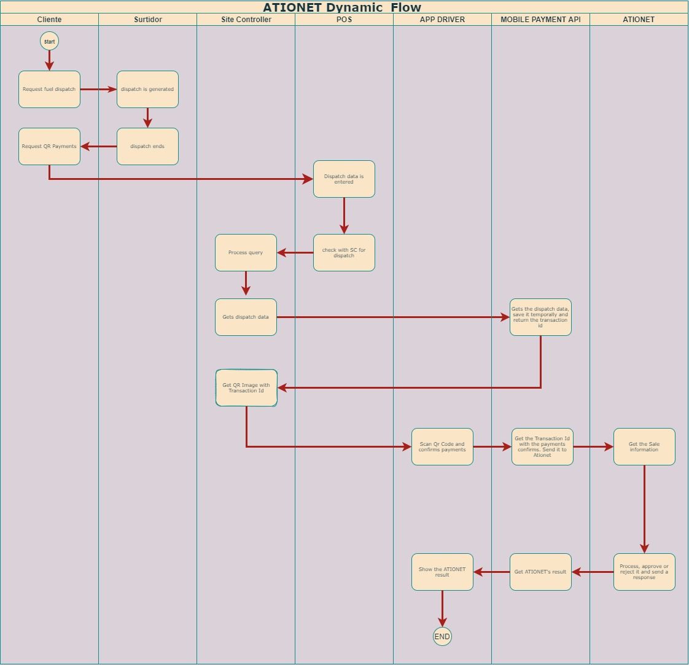
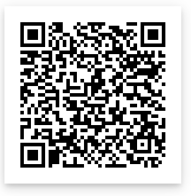

# ATIONet - Dynamic QR Code Payments #

|Document Information||
|--- |--- |
|File:|ATIONet - Dynamic QR Code Payments|
|Doc Version:|1.0|
|Release Date:|26, August 2021|
|Author:|ATIONet LLC|

|Change Log|||
|--- |--- |--- |
|Ver.|Date|Change Summary|
|1.0|26/August/2021|Initial version.|

## Contents ##

- [Overview](#overview)
	- [Introduction](#introduction)
	- [Overview of Dynamic QR Code](#Overview-of-Dynamic-QR-Code)
- [QR code Payments squence](#QR-code-Payments-squence)
- [Dynamic QR Code Payments Implementation](#Dynamic-QR-Code-Payments-Implementation)	
	- [Introduction](#Introduction)
	- [STEP 1 Get your authentication keys (Pending/ In progress)](#STEP-1-Get-your-authentication-keys)
	- [STEP 2 Create Dynamic QR Code](#STEP-2-Create-Dynamic-QR-Code)
	- [STEP 3 Customer scans Dynamic QR code](#STEP-3-Customer-scans-Dynamic-QR-code)
	- [STEP 4 Confirm the Transaction Status](#STEP-4-Confirm-the-Transaction-Status)
	- [Integration Checklist](#Integration-Checklist)
- [API Documentation](#API-Documentatio)
	 - [Get Sale Method](#Get-Sale-Method)
		- [Description](#Description)
		- [Request Format](#Request-Format)
		- [Response Format](#Request-Format)
		- [Request Example](#Request-Example-of-Get-Sale-method)
	- [Sale Method](#Sale-Method)
		- [Description](#Description)
		- [Request Format](#Request-Format)
		- [Response Format](#Request-Format)
		- [Request Example](#Request-Example-of-Sale-method)
- [Transaction Sequence Number](#Transaction-Sequence-Number)
- [Error handling](#Error-handling)
- [Messages samples](#Messages-samples)
	- [Create method](#create-method)
	- [Get Sale Method](#Get-Sale-method)
	- [Process Sale method](#Process-Sale-method)
	
## Overview


### Introduction

Ationet fleet Mobile payments - Dynamic QR  allows to generate the dynamic QR code from their Billing POS/System for a specific order/bill and must pass the order-specific information such as Dispatch ID, Order Amount, etc. while generating the code. The customer can scan this QR to make a payment and the POS's Backend can check the transaction status using the Dispatch ID.

``` 
Note: A customer-facing screen is required, which will show the dynamically generated QR to him in order to be able to
scan it and generate the sale.

```

### Overview of Dynamic QR Code

<ol>
	<li>Customer chooses the goods/service in a store and shows the intent to the cashier for Ationet Driver App payment.</li>
	<li>Cashier creates an order with the bill amount and a unique Dispatch ID in the POS system.</li>
	<li>POS’s backend server  Create QR Code  and displays it to the Customer on the consumer-facing screen.</li>
	<li>Customer scans QR code via Ationet Driver App.</li>
	<li>POS’s backend server automatically starts polling the Transaction status every 8 times/minute using Dispatch ID.</li>
</ol>


## QR code Payments squence



## Dynamic QR Code Payments Implementation

### Introduction

The section describes the integration steps required to integrate ATIONet's Dynamic QR Code Payments with billing POS to accept contactless payment from your customer using the Ationet Driver App payment.

### STEP 1 Get your authentication keys

>You must required your keys from ATIONET

<ul>
	<li>POS's Backend Key: A unique secret key used to secure encryption of every request. This needs to be kept on server-side and should not be shared with anyone.</li>
</ul>

```
Note: Never share your secret POS's Backend Key with anyone.
```


### STEP 2 Create Dynamic QR Code

POS's Backend only encodes the minimum sale information in QR, it is the one that comes from site controller when generating a sale. The rest of the plot information is completed by the POS's Backend. The following table describes each field in the table, its description and its origin.

```
Important: the request body have to be in JSON format. QR image must be free text type.

```

<table>
	<thead>
		<tr valign="center">
			<th rowspan="2"  align="left">
				Name
			</th>
			<th rowspan="2" align="center">
				Type
			</th>
			<th rowspan="2" align="left">
				Origin
			</th>
			<th rowspan="8" align="left">
				Description
			</th>
		</tr>
	</thead>
	<tbody>
		<tr valign="top">
			<td>
				<p align="left">IDDispatch</p>
			</td>
			<td>
				<p align="center">(string) Guid</p>
			</td>
			<td>
			 	<p align="center">Site controller or POS Backend</p>
			 </td>
			<td>
				<p>XXXXXXXX-XXXX-XXXX-XXXX-XXXXXXXXXXXX</p>
			</td>
		 </tr>
		 <tr valign="top">
			<td>
				<p align="left">PumpNumber</p>
			</td>
			<td>
				<p align="center">string</p>
			</td>
			<td>
			 	<p align="center">Site controller</p>
			 </td>
			<td>
				<p>“00”-“99”</p>
			</td>
		 </tr>
		<tr valign="top">
			<td>
				<p align="left">TerminalIdentification</p>
			</td>
			<td>
				<p align="center">string</p>
			</td>
			<td>
			 	<p align="center">Site controller/POS IdentificationAtionet</p>
			 </td>
			<td>
				<p>It must be requested from ATIONet</p>
			</td>
		 </tr>
		<tr valign="top">
			<td>
				<p align="left">TransactionAmount</p>
			</td>
			<td>
				<p align="center">double</p>
			</td>
			<td>
			 	<p align="center">Site controller</p>
			 </td>
			<td>
				<p>xxxxxxx.xx</p>
			</td>
		 </tr>
		<tr valign="top">
			<td>
				<p align="left">ProductCode</p>
			</td>
			<td>
				<p align="center">string</p>
			</td>
			<td>
			 	<p align="center">Site controller</p>
			 </td>
			<td>
				<p>“0”-“9999”</p>
			</td>
		 </tr>
		<tr valign="top">
			<td>
				<p align="left">ProductUnitPrice</p>
			</td>
			<td>
				<p align="center">double</p>
			</td>
			<td>
			 	<p align="center">Site controller</p>
			 </td>
			<td>
				<p>xxx.xx</p>
			</td>
		 </tr>
		<tr valign="top">
			<td>
				<p align="left">ProductAmount</p>
			</td>
			<td>
				<p align="center">double</p>
			</td>
			<td>
			 	<p align="center">Site controller</p>
			 </td>
			<td>
				<p>xxxxxxx.xx</p>
			</td>
		 </tr>
		<tr valign="top">
			<td>
				<p align="left">ProductQuantity</p>
			</td>
			<td>
				<p align="center">double</p>
			</td>
			<td>
			 	<p align="center">Site controller</p>
			 </td>
			<td>
				<p>xxxxxxx.xx</p>
			</td>
		 </tr>
		</tbody>
</table>

### Examples

In [Create method](#create-method) section you can find a request body sample in `Json` format.

#### QR Image example



### STEP 3 Confirm the Transaction Status

When the QR code is generated for an specific transaction, the POS's Backend Get The Transaction status with a polling process using the [Transaction status API](#Get-Sale-Method).

```
Polling : Setup a polling process after regular intervals using the Transaction Status API. 
To get the best results out of a status query, you should check the status 8 times/minute.

```

### STEP 4 Customer scans Dynamic QR code

When the QR code is generated for an specific transaction, the customer scans that QR code and pays using Ationet Driver App. The customer is notified about the payment status on their Ationet Driver App  after the successful completion of payment. If you want to implement a new client app you can check the specification of the [create sale api](#Sale-Method).


```
Note: Customers cannot change the Transaction amount in their app on scanning the particular order QR code.
```


### Integration Checklist

Post completion of integration in your staging environment, it is mandatory to test the integration before moving into the live environment with production. Below points should be taken care of during the integration of the flow:

<ol>
   <li>The Transaction status should be verified through the Transaction Status API in the payment flow.</li>	
   <li>The Dispacht ID passed to Ationet should be unique.</li>	
   <li>The amount must not contain more than 2 decimal points, comma, or any special characters.</li>	 
   <li>Dispatch ID parameter is mandatory for creating QR.</li>	
</ol>

## API Documentation

*Production URL:  ationetmobilepayment-appshost.azurewebsites.net* </br>
*QA URL:  ationetmobilepayment-appshost-test.azurewebsites.net* </br>

### Create method

#### Description

Receive the sale's information. Returns the Transaction's Id, the QR Type, the URL to do the Sale and the QR Code Image encode in base 64 format.

>`WARNING`: you have 120 secs to confirm the payment. After that the Transaction won't available. 

>This method require basic auth through header. Example `Basic user:pass`.

#### Request Format

URL: /api/QR/Create
Method: HttpPost

```
body {
  "Sale": {
    "IdDispatch":"string",    
    "PumpNumber": "string",
    "TerminalIdentification": "string",
    "TransactionAmount": double,
    "ProductCode": "string",
    "ProductUnitPrice": double,
    "ProductAmount": double,
    "ProductQuantity": double
  },
  "ImageRequired": bool
}

```
imageRequired: If you send it in true, the response will return the property `image` with the QR Image enconde in base 64. By default is false.

>You can check the description values in [STEP 2 Create Dynamic QR Code](#STEP-2-Create-Dynamic-QR-Code) section.

#### Response Format

Header:
```
Content-Type: application/json; charset=utf-8
content-encoding: gzip

```

```
body { 
	"transactionId":"string",
	"qrData":"string",
	"image":"string",
	"mpqrType":int
}
```

Response properties description
	
```
"transactionId": The transaction Id.
"qrData": Contais the data to be enconde in a QR Image.
"image": If imageRequired was sent true, contaSi el campo imageRequired fue enviado en verdadero contiene la imagen del código QR codificada en base 64. By default is empty.
"mpqrType": Is the QR Image type. By default the number 2 indicates that image is for Dynamic QR.

```

### Get Transaction status

#### Description

Return a Sale information.

>This method require basic auth through header. Example `Basic user:pass`.

#### Request Format

*URL: /api/QR/GetTransactionStatus* </br>
*Method: HttpPost* </br>

```
Body { "idDispatch": "string" }

```

##### Properties description

<table>
	<thead>
		<tr valign="center">
			<th rowspan="2"  align="left">
				Name
			</th>
			<th rowspan="8" align="left">
				Description
			</th>
		</tr>
	</thead>
	<tbody>
		<tr valign="top">
			<td>
				<p align="left">idDispatch</p>
			</td>
			<td>
				<p>Is the Transaccion Id</p>
			</td>
		 </tr>
		</tbody>
</table>

#### Response Format

Header:
```
Content-Type: application/json; charset=utf-8
content-encoding: gzip 
```

```
body { "AuthorizationCode": "string", "ResponseCode": "string", "ResponseMessage":  "string" }

```

### Process Sale Method

#### Description

Create a Sale. The sale creation receive the Transaction Id and the driver's primaryTrack.

>This method require basic auth through header. Example `Basic user:pass`.

#### Request Format

*URL: /api/QR/ProccessSale/{id}/{primaryTrack}* </br>
*Method: HttpGet* </br>

##### Parameters description

<table>
	<thead>
		<tr valign="center">
			<th rowspan="2"  align="left">
				Name
			</th>
			<th rowspan="8" align="left">
				Description
			</th>
		</tr>
	</thead>
	<tbody>
		<tr valign="top">
			<td>
				<p align="left">id</p>
			</td>
			<td>
				<p>Is the Transaccion Id</p>
			</td>
		 </tr>
		<tr valign="top">
			<td>
				<p align="left">primaryTrack</p>
			</td>
			<td>
				<p>The driver identifier</p>
			</td>
		 </tr>
		</tbody>
</table>

#### Response Format 

Header:
```
Content-Type: application/json; charset=utf-8
content-encoding: gzip 
```

```
body { "AuthorizationCode": "string", "ResponseCode": "string", "ResponseMessage":  "string", "TransactionIdMobile": "string" }

```

## Error handling

Success/failure exits on the Interface API will be handled via HTTP status codes.

Successful request will get a HTTP 200 and the resulting response.

Failure to process the request will be indicated by an HTTP 400’s range status code. The body will contain a single JSON-formatted item with the “ResponseCode”, “ResponseMessage” and “ResponseError” fields.


## Messages samples

### Create method

#### Request example

```
{
  "Sale": {
    "IdDispatch":"16e8f1e0-4969-4836-817a-7426a3b2fdc1",    
    "PumpNumber": "1",
    "TerminalIdentification": "S2G321",
    "TransactionAmount": 99,
    "ProductCode": "1",
    "ProductUnitPrice": 1,
    "ProductAmount": 99,
    "ProductQuantity": 99
  },
  "ImageRequired": true
}

```

#### Response example

```
{ 
	"transactionId":"80ab2f6c-e4a3-4c5c-8729-d10c1059a511",
	"qrData":"https://ationetmobilepayment-appshost-test.azurewebsites.net/api/QR/ProccessSale/ProccessSale/80ab2f6c-e4a3-4c5c-8729-d10c1059a511",
	"image":"data:image/png;base64,iVBORw0KGgoAAAANSUhEUgAAAMgAAADICAYAAACtWK6eAAAAAXNSR0IArs4c6QAADi5JREFUeF7tndF24zYMRJ3//+j0NK1bJSuZl4+/E8ERGAXgQ8FGAXgQ8FGAXgQ8FIjNE",
	"mpqrType":2
}

```

### Get Transaction status

#### Request example

```
{ "idDispatch": "3fa85f64-5717-4562-b3fc-2c963f66afa6" }

```

#### Response example

```
{
  "authorizationCode": "072613127",
  "responseCode": "00000",
  "responseMessage": "Autorizado"
}


```

### Process Sale method

#### Request example

```
api/QR/ProccessSale/3fa85f64-5717-4562-b3fc-2c963f66afa6/00000001

```

#### Response example

```
{
  "authorizationCode": "072613127",
  "responseCode": "00000",
  "responseMessage": "Autorizado",
  "TransactionIdMobile": 3fa85f64-5717-4562-b3fc-2c963f66afa6
}

```
