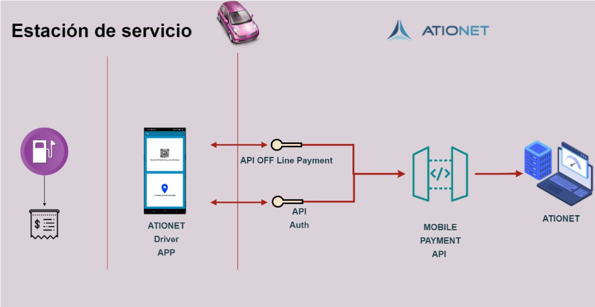
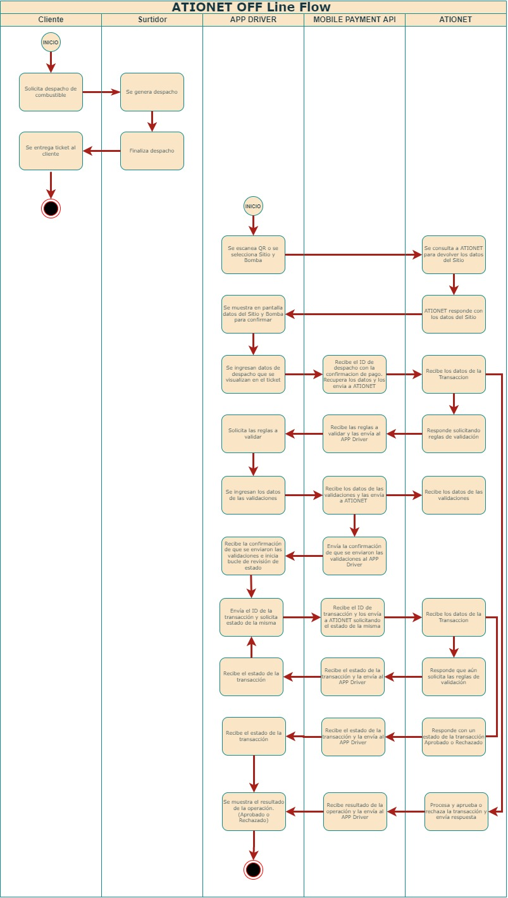

# ATIONet - OFF Line Payments #

|Document Information||
|--- |--- |
|File:|ATIONET - Pagos OFF Line|
|Doc Version:|1.0|
|Release Date:|12, November 2021|
|Author:|ATIONet LLC|

|Change Log|||
|--- |--- |--- |
|Ver.|Date|Change Summary|
|1.0|12/November/2021|Initial version.|

## Contenido ##

- [Visión general](#Visión-general) 
	- [Introduction](#Introduccion)
	- [Descripcion general del modo OFF Line](#Descripcion-general-del-modo-OFF-Line)
- [Secuencia de pagos con modo OFF Line](#Secuencia-de-pagos-con-modo-OFF-Line)
- [Implementación de pagos con modo OFF Line](#Implementación-de-pagos-con-modo-OFF-Line)	
	- [Introducción](#Introducción)
	- [PASO 1 Obtener sus claves de autenticación (Pendiente/En desarrollo)](#PASO-1-Obtener-sus-claves-de-autenticación)
	- [PASO 2 Crear solicitud de pago en modo OFF Line](#PASO-2-Crear-solicitud-de-pago-en-modo-OFF-Line)
	- [PASO 3 Confirmar el estado de la Transacción](#PASO-3-Confirmar-el-estado-de-la-Transacción)
	- [Posibles estados  de las Transacciones de modo OFF Line](#Posibles-estados--de-las-Transacciones-de-modo-OFF-Line)
	- [PASO 4 (opcional) El cliente envía las reglas](#PASO-4-(opcional)-El-cliente-envía-las-reglas)
- [Documentación de API](#Documentación-de-API)
	- [Método Crear y procesar](#Método-Crear-y-procesar)
	- [Método Obtener el estado de una Transacción](#Método-Obtener-el-estado-de-una-Transacción)
	- [Método Validar reglas](#Método-Validar-reglas)
- [Manejo de errores](#Manejo-de-errores)
- [Mensajes de ejemplo](#Mensajes-de-ejemplo)
	 - [Ejemplo método Crear y procesar](#Ejemplo-método-Crear-y-procesar)
 	 - [Ejemplo método Obtener estado de una Transacción](#Ejemplo-métodoObtener-estado-de-una-Transacción)
	 - [Ejemplo método Validar reglas](#Ejemplo-método-Validar-reglas)
	

## Visión general



### Introduccion:

Ationet Fleet Mobile Payments - OFF Line Permite realizar una venta sin la necesidad de recibir los datos de la misma del POS/Sistema de facturación. Luego de realizado el despacho de combustible
el cliente obtiene los datos del Sitio y la bomba seleccionando de forma manual o escaneando la imagen de Código QR  y completa con los datos de la venta brindados por el playero a través del ticket.

### Descripcion general del modo OFF Line

<ol>
	<li>El playero realiza el despacho y entrega el ticket indicando al cliente que no hay conexion para poder gestionar el pago de manera online.</li>
	<li>El cliente con la APP Driver escanea QR o selecciona manualmente el Sitio y la Bomba, solicita a ATIONET la informacion que devuelve indicando los datos correspondientes.</li>
	<li>Se habilita la pantalla en la APP Driver para Cargar los campos Indicados en el ticket de despacho.</li>
	<li>Se confirma la venta, se envia la Transaccion a ATIONET que confirma o rechaza la Venta, o en un tercer caso de ser necesario solicita verificación de reglas.</li>
	<li>Si ATIONET solicita verificación de reglas, estas son solicitadas al cliente y una vez enviadas, se deberá consultar el estado de la transacción hasta que ATIONET confirme o rechaze la venta.</li>
	<li>Si el cliente ingreso un valor diferente al valor despachado, si el valor ingresado fue menor, el playero le solicitará que ingrese un nuevo pago, y si el valor ingresado fue mayor, el cliente deberá comunicarse con el Company Admin.</li>
</ol>

## Secuencia de pagos con modo OFF Line



## Implementación de pagos con modo OFF Line

### Introducción

La sección describe los pasos necesarios para integrar los pagos con modo OFF Line de ATIONet con el punto de venta de facturación para aceptar pagos mediante la aplicación Ationet Driver.

### PASO 1 Obtener sus claves de autenticación

<ul>
	<li>Clave de backend de POS: una clave secreta única que se utiliza para asegurar el cifrado de cada solicitud. Esto debe mantenerse en el lado del servidor y no debe compartirse con nadie.</li>
</ul>

> Debe solicitar sus claves a ATIONET.

```
Nota: Nunca comparta la clave secreta de backend de su POS con nadie.
```


### PASO 2 Crear solicitud de pago en modo OFF Line

El playero entrega el ticket con los datos del despacho, luego el cliente selecciona si quiere escanear el QR de la bomba o quiere seleccionar el sitio y bomba de manera manual desde la aplicación, luego ingresa manualmente la información del ticket y la envía.
Los datos enviados a Mobile Payment API son:

<table>
	<thead>
		<tr valign="center">
			<th rowspan="2"  align="left">
				Nombre
			</th>
			<th rowspan="2" align="center">
				Tipo
			</th>
			<th rowspan="2" align="left">
				Origen
			</th>
			<th rowspan="8" align="left">
				Descripción
			</th>
		</tr>
	</thead>
	<tbody>
		<tr valign="top">
			<td>
				<p align="left">IDDispatch</p>
			</td>
			<td>
				<p align="center">(string) Guid</p>
			</td>
			<td>
			 	<p align="center">Completado por la app</p>
			 </td>
			<td>
				<p>XXXXXXXX-XXXX-XXXX-XXXX-XXXXXXXXXXXX</p>
			</td>
		 </tr>
		 <tr valign="top">
			<td>
				<p align="left">PumpNumber</p>
			</td>
			<td>
				<p align="center">string</p>
			</td>
			<td>
			 	<p align="center">El cliente lo ingresa por QR o seleccionando en lista de opciones</p>
			 </td>
			<td>
				<p>“00”-“99”</p>
			</td>
		 </tr>
		<tr valign="top">
			<td>
				<p align="left">TerminalIdentification</p>
			</td>
			<td>
				<p align="center">string</p>
			</td>
			<td>
			 	<p align="center">Completado por la app</p>
			 </td>
			<td>
				<p>Debe solicitarse a ATIONet</p>
			</td>
		 </tr>
		<tr valign="top">
			<td>
				<p align="left">ProductCode</p>
			</td>
			<td>
				<p align="center">string</p>
			</td>
			<td>
			 	<p align="center">El cliente lo ingresa manualmente</p>
			 </td>
			<td>
				<p>“0”-“9999”</p>
			</td>
		 </tr>
		<tr valign="top">
			<td>
				<p align="left">ProductUnitPrice</p>
			</td>
			<td>
				<p align="center">decimal</p>
			</td>
			<td>
			 	<p align="center">El cliente lo ingresa manualmente</p>
			 </td>
			<td>
				<p>xxx.xx</p>
			</td>
		 </tr>
		<tr valign="top">
			<td>
				<p align="left">ProductAmount</p>
			</td>
			<td>
				<p align="center">decimal</p>
			</td>
			<td>
			 	<p align="center">El cliente lo ingresa manualmente</p>
			 </td>
			<td>
				<p>xxxxxxx.xx</p>
			</td>
		 </tr>
		<tr valign="top">
			<td>
				<p align="left">ProductQuantity</p>
			</td>
			<td>
				<p align="center">decimal</p>
			</td>
			<td>
			 	<p align="center">Completado por la app</p>
			 </td>
			<td>
				<p>xxxxxxx.xx</p>
			</td>
		 </tr>
		<tr valign="top">
			<td>
				<p align="left">ProductDescription</p>
			</td>
			<td>
				<p align="center">string</p>
			</td>
			<td>
			 	<p align="center">Completado por la app</p>
			 </td>
			<td>
				<p>(OPCIONAL) La descripción del producto.</p>
			</td>
		 </tr>
		<tr valign="top">
			<td>
				<p align="left">localTransactionDate</p>
			</td>
			<td>
				<p align="center">integer</p>
			</td>
			<td>
			 	<p align="center">Completado por la app con formato yyyymmdd</p>
			 </td>
			<td>
				<p>Es la fecha local de la Transacción</p>
			</td>
		 </tr>
		<tr valign="top">
			<td>
				<p align="left">localTransactionTime</p>
			</td>
			<td>
				<p align="center">integer</p>
			</td>
			<td>
			 	<p align="center">Completado por la app con formato hhmmss</p>
			 </td>
			<td>
				<p>Es la hora local de la de la Transacción</p>
			</td>
		 </tr>
		</tbody>
</table>

### Ejemplos

En la seccion [Ejemplo método crear y procesar](#Ejemplo-método-crear-y-procesar) puede encontrar un ejemplo de como es la trama en formato `Json`.

#### Ejemplo de imagen QR de una bomba


### PASO 3 Confirmar el estado de la Transacción

Una vez enviado el request del [método Crear y procesar](#Método-Crear-y-procesar), responderá con el estado de la transacción

### Posibles estados  de las Transacciones de modo OFF Line

<table>
	<thead>
		<tr valign="center">
			<th rowspan="2"  align="left">
				Nombre
			</th>
			<th rowspan="8" align="left">
				Descripción
			</th>
		</tr>
	</thead>
	<tbody>
		<tr valign="top">
			<td>
				<p align="left">Post Paid Confirmed</p>
			</td>
			<td>
				<p>La transacción fue aprobada</p>
			</td>
		 </tr>
		<tr valign="top">
			<td>
				<p align="left">Prompting needed</p>
			</td>
			<td>
				<p>Se le solicita al cliente la verificación de reglas</p>
			</td>
		 </tr>
		<tr valign="top">
			<td>
				<p align="left">Prompting sent</p>
			</td>
			<td>
				<p>Se le solicita al cliente la verificación de reglas</p>
			</td>
		 </tr>
		<tr valign="top">
			<td>
				<p align="left">Refused</p>
			</td>
			<td>
				<p>La transacción fue rechazada</p>
			</td>
		 </tr>
		<tr valign="top">
			<td>
				<p align="left">Cancelled By MPPA</p>
			</td>
			<td>
				<p>La Transaccion se vence por time out</p>
			</td>
		 </tr>
		</tbody>
</table>

### PASO 4(opcional) El cliente envía las reglas

Si el [método Crear y procesar](#Método-Crear-y-procesar) responde con el estado Prompting needed, el usuario deberá validar reglas adicionales al endPoint del [Método Validar reglas](#Método-Validar-reglas), y luego la app driver deberá verificar el estado de la transacción utilizando el [método Obtener el estado de una Transacción](#Método-Obtener-el-estado-de-una-Transacción) continuamente hasta que le responda un estado diferente al Prompting needed

>Nota: Se recomienda consultar el estado de transacción 8 veces por minuto.

### Reglas

En ATIONet las reglas se refieren a límites que pueden ser configurados por la empresa y asociados a distintas entidades. Cuando la entidad tenga una regla de solicitud, ATIONET responderá solicitando información adicional para aprobarla.

Las reglas solicitadas pueden ser una o varias de las siguientes:

```
	"PromptPrimaryPin": "string",
        "PromptSecondaryTrack": "string",
        "PromptOdometer": "string",
        "PromptDriverId": "string",
        "PromptVehicleId": "string",
        "PromptTruckUnitNumber": "string",
        "PromptTrailerNumber": "string",
        "PromptEngineHours": "string",
        "PromptMiscellaneous": "string"
```

>Nota: El valor siempre será "true"

### Casos especiales

En algunos casos, como el de `Odometer` o ` EngineHours`, la regla puede solicitar un mínimo y/o un rango de valores. Por ejemplo: 

```
	"PromptOdometer": "true",
        "LastOdometer": "140",
        "MinOdometer": "150",
        "MaxOdometer": "1000",
```

### Como responder a las reglas

Se responden consumiento el endPoint del [Método Validar reglas](#Método-Validar-reglas), debe incluirse el ID de la transacción y las reglas solicitadas.

Para cada regla, debe responder con el nombre de la regla y su valor respectivo. Los nombres de respuesta son:


```
        "PrimaryPin": "string",
        "SecondaryTrack": "string",
        "Odometer": "string",
        "DriverId": "string",
        "VehicleId": "string",
        "TruckUnitNumber": "string",
        "TrailerNumber": "string",
        "EngineHours": "string",
        "Miscellaneous": "string"
```


## Documentación de API 

*URL Productiva:  ationetmobilepayment-appshost.azurewebsites.net* </br>
*URL QA:  ationetmobilepayment-appshost-test.azurewebsites.net* </br>

### Método Crear y procesar

#### Descripción

Recibe la información completa de la venta, y procesa la misma.

El IdDispatch enviado deberá ser único.

>Éste método requiere autenticacion a través del encabezado. Deberá ser de tipo basica. ejemplo: `Basic usuario:clave`

#### Formato de solicitud

*URL: /api/PostPaid/CreateAndProcess* </br>
*Method: HTTPost* </br>

```
body {
  "sale": {
    "idDispatch": "string",
    "pumpNumber": "string",
    "terminalIdentification": "string",
    "productCode": "string",
    "productUnitPrice": decimal,
    "productAmount": decimal,
    "productQuantity": decimal,
    "productDescription": "string",
    "localTransactionDate": integer,
    "localTransactionTime": integer
  },
  "primaryTrack": "string"
}
```

>Puede consultar la descripcion de los valores en la sección [PASO 2 Crear solicitud de pago en modo OFF Line](#PASO-2-Crear-solicitud-de-pago-en-modo-OFF-Line)


#### Formato de respuesta

Header:
```
Content-Type: application/json; charset=utf-8
content-encoding: gzip 
```
```
body 
{ 
	"AuthorizationCode": "string", 
	"ResponseCode": "string", 
	"ResponseMessage":  "string", 
    	"IdTransaction": "string",
  	"CustomerData": {
		"PromptPrimaryPin": "string",
		"PromptSecondaryTrack": "string",
		"PromptOdometer": "string",
		"LastOdometer": "string",
		"MinOdometer": "string",
		"MaxOdometer": "string"
		"PromptDriverId": "string",
		"PromptVehicleId": "string",
		"PromptTruckUnitNumber": "string",
		"PromptTrailerNumber": "string",
		"PromptEngineHours": "string",
		"PromptMiscellaneous": "string"
	}
}
```
>Atención: El Objeto CustomerData sólo contendra información en caso de que se soliciten reglas.

### Método Obtener el estado de una Transacción

#### Descripción

Obtiene el estado de una Transacción.

>Éste método requiere autenticacion a través del encabezado. Deberá ser de tipo basica. ejemplo: `Basic usuario:clave`

#### Formato de solicitud

*URL: /api/PostPaid/GetTransactionStatus* </br>
*Method: HTTPost* </br>

```
Body { "idDispatch": "string" }
```

##### Descripción de los propiedades

<table>
	<thead>
		<tr valign="center">
			<th rowspan="2"  align="left">
				Nombre
			</th>
			<th rowspan="8" align="left">
				Descripción
			</th>
		</tr>
	</thead>
	<tbody>
		<tr valign="top">
			<td>
				<p align="left">idDispatch</p>
			</td>
			<td>
				<p>Es el identificador de la transacción</p>
			</td>
		 </tr>
		</tbody>
</table>

#### Formato de respuesta
Header:
```
Content-Type: application/json; charset=utf-8
content-encoding: gzip 
```
```
body 
{ 
	"AuthorizationCode": "string", 
	"ResponseCode": "string", 
	"ResponseMessage":  "string", 
	"TransactionStatus":
		{
			"name":"string",
			"id": int
		} 
}
```

### Método Validar reglas

#### Descripción

Valida las reglas adicionales.

#### Formato de solicitud

*URL: /api/PostPaid/RulesValidations* </br>
*Method: HTTPost* </br>

```
Body {
  "idTransaction": "string",
  "customerData": {
  	"PrimaryPin": "string",
        "SecondaryTrack": "string",
        "Odometer": "string",
        "DriverId": "string",
        "VehicleId": "string",
        "TruckUnitNumber": "string",
        "TrailerNumber": "string",
        "EngineHours": "string",
        "Miscellaneous": "string"
	}
}
```

#### Formato de respuesta
Header:
```
Content-Type: application/json; charset=utf-8
content-encoding: gzip 
```

Éste metodo devuelve una respuesta satisfactoria si pudo validar las reglas (200 Ok). Devuelve Bad Request indicando en el campo `message` el motivo por el cual no pudo validar las reglas.

### Manejo de errores

Las salidas exitosas / fallidas en la API de la interfaz se manejarán a través de códigos de estado HTTP.

La solicitud exitosa obtendrá un HTTP 200 y la respuesta resultante.

Si no se procesa la solicitud, se indicará mediante un código de estado de rango HTTP 400. El cuerpo contendrá un solo elemento con formato JSON con los campos "ResponseCode", "ResponseMessage" y "ResponseError".


## Mensajes de ejemplo

### Ejemplo método Crear y procesar

#### Formato de solicitud

```
body:

{
  "sale": {
    "IdDispatch":"de1ae20c-858c-4989-a334-43992df5c45c",
    "PumpNumber": "1",
    "TerminalIdentification": "S2G321",
    "ProductCode": "1",
    "ProductUnitPrice": 1,
    "ProductAmount": 10,
    "ProductDescription": "SUPER",
    "productQuantity": 299
    "localTransactionDate": 20211117
    "localTransactionTime": 141414
  },
  "primaryTrack": "2456722042482930556=3606=000000""
}
```

#### Formato de respuesta

```
{
    "idTransaction": "3f34bdf9-15e2-4ef4-9134-f5a53ac360a8",
    "authorizationCode": "035657109",
    "responseCode": "40500",
    "responseMessage": "Solicitud requerida",
    "customerData": {
        "PromptEngineHours": "true",
        "MinEngineHours": "66",
        "ContractMode": "2"
    }
}
```

### Ejemplo método Obtener estado de una Transacción

#### Formato de solicitud


```
{
  "idDispatch": "3fa85f64-5717-4562-b3fc-2c963f66afa6"
}
```

#### Formato de respuesta

```
{
  "authorizationCode": "072613127",
  "responseCode": "00000",
  "responseMessage": "Autorizado"
}
```


### Ejemplo método Validar reglas

#### Formato de solicitud


```
{
  "idTransaction": "f6f80f9a-7fb6-4d7c-9dca-18662d2147d0",
  "customerData": {
    "Odometer":"88"
  }
}
```

#### Formato de respuesta

```
{}
```
